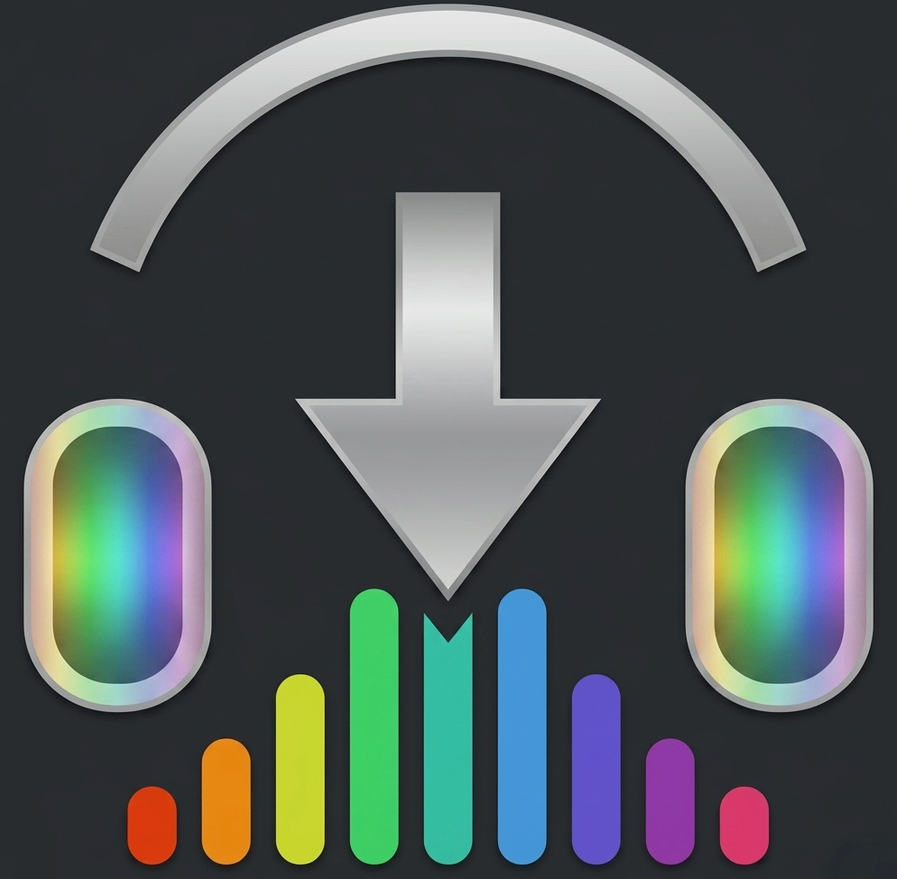
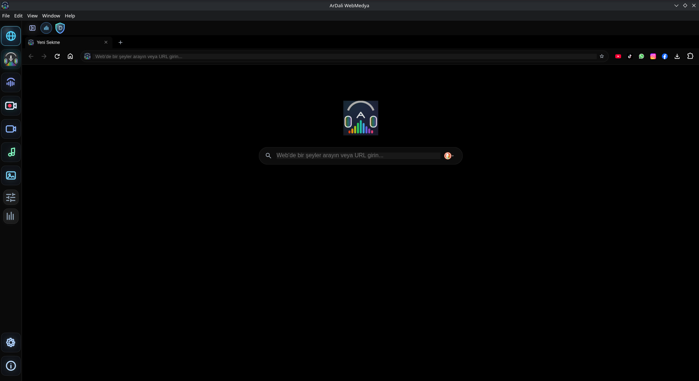
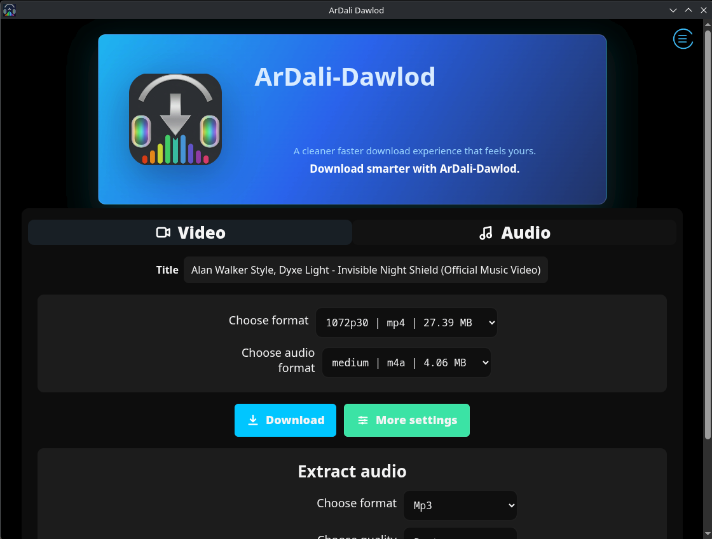
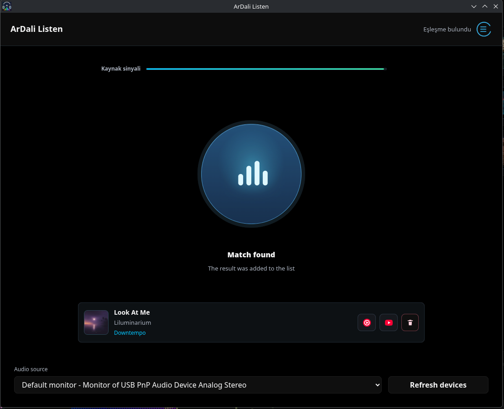
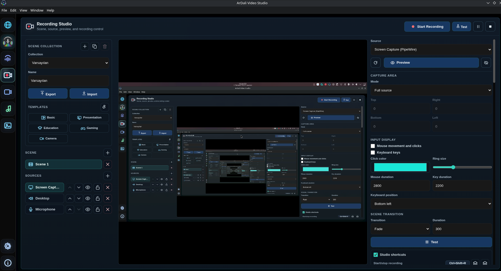
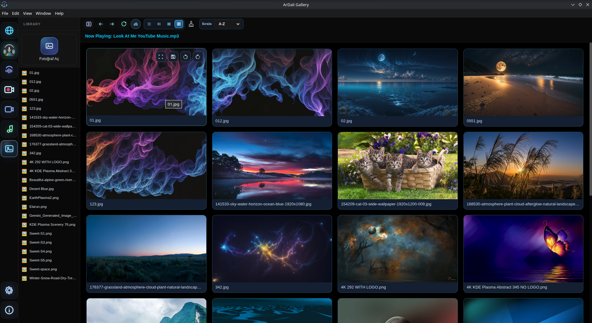
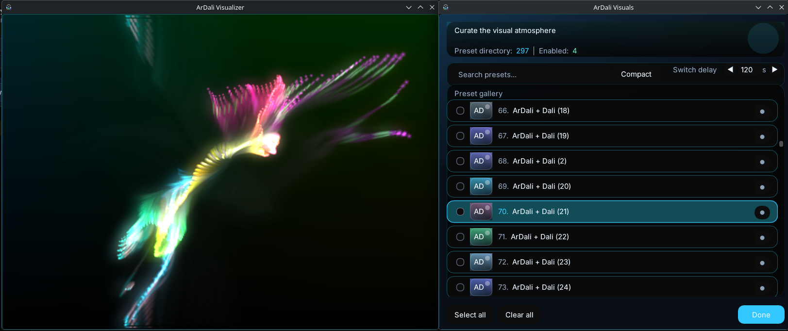
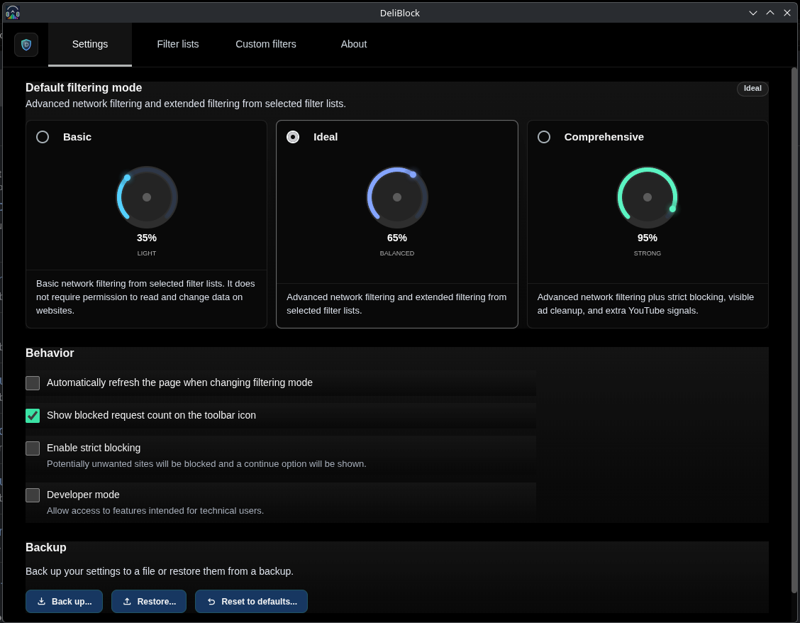

<p align="center">
  
</p>

<p align="center">
  <a href="https://github.com/Muhammed-Dali/ArDali-WebMedia/releases/latest">
    
  </a>
  <a href="https://github.com/Muhammed-Dali/ArDali-WebMedia/releases">
    
  </a>
  <a href="https://github.com/Muhammed-Dali/ArDali-WebMedia/actions/workflows/build-linux.yml">
    
  </a>
  <a href="https://github.com/Muhammed-Dali/ArDali-WebMedia/blob/main/LICENSE">
    
  </a>
</p>

<p align="center">
  <a href="https://github.com/Muhammed-Dali/ArDali-WebMedia/releases/latest">
    
  </a>
  <a href="https://github.com/Muhammed-Dali/ArDali-WebMedia/releases/tag/pacman-repo">
    
  </a>
  <a href="https://aur.archlinux.org/packages/ardali-bin">
    
  </a>
</p>

## 🌳 Feature Tree

Click on any module icon in the feature tree below to quickly navigate to its details and screenshots.

<table align="center" style="border: none; background-color: transparent;">
  <tr style="border: none; background-color: transparent;">
    <td rowspan="10" align="center" valign="middle" style="border: none; background-color: transparent;">
      
    </td>
    <td align="center" valign="middle" style="border: none; background-color: transparent;"><h2>&rarr;</h2></td>
    <td align="center" valign="middle" style="border: none; background-color: transparent;">
      <a href="#web-browser"></a>
    </td>
  </tr>
  <tr style="border: none; background-color: transparent;">
    <td align="center" valign="middle" style="border: none; background-color: transparent;"><h2>&rarr;</h2></td>
    <td align="center" valign="middle" style="border: none; background-color: transparent;">
      <a href="#media-downloader"></a>
    </td>
  </tr>
  <tr style="border: none; background-color: transparent;">
    <td align="center" valign="middle" style="border: none; background-color: transparent;"><h2>&rarr;</h2></td>
    <td align="center" valign="middle" style="border: none; background-color: transparent;">
      <a href="#song-recognition"></a>
    </td>
  </tr>
  <tr style="border: none; background-color: transparent;">
    <td align="center" valign="middle" style="border: none; background-color: transparent;"><h2>&rarr;</h2></td>
    <td align="center" valign="middle" style="border: none; background-color: transparent;">
      <a href="#screen-recorder"></a>
    </td>
  </tr>
  <tr style="border: none; background-color: transparent;">
    <td align="center" valign="middle" style="border: none; background-color: transparent;"><h2>&rarr;</h2></td>
    <td align="center" valign="middle" style="border: none; background-color: transparent;">
      <a href="#video-player"></a>
    </td>
  </tr>
  <tr style="border: none; background-color: transparent;">
    <td align="center" valign="middle" style="border: none; background-color: transparent;"><h2>&rarr;</h2></td>
    <td align="center" valign="middle" style="border: none; background-color: transparent;">
      <a href="#music-player"></a>
    </td>
  </tr>
  <tr style="border: none; background-color: transparent;">
    <td align="center" valign="middle" style="border: none; background-color: transparent;"><h2>&rarr;</h2></td>
    <td align="center" valign="middle" style="border: none; background-color: transparent;">
      <a href="#gallery"></a>
    </td>
  </tr>
  <tr style="border: none; background-color: transparent;">
    <td align="center" valign="middle" style="border: none; background-color: transparent;"><h2>&rarr;</h2></td>
    <td align="center" valign="middle" style="border: none; background-color: transparent;">
      <a href="#sound-effects"></a>
    </td>
  </tr>
  <tr style="border: none; background-color: transparent;">
    <td align="center" valign="middle" style="border: none; background-color: transparent;"><h2>&rarr;</h2></td>
    <td align="center" valign="middle" style="border: none; background-color: transparent;">
      <a href="#visualizer"></a>
    </td>
  </tr>
  <tr style="border: none; background-color: transparent;">
    <td align="center" valign="middle" style="border: none; background-color: transparent;"><h2>&rarr;</h2></td>
    <td align="center" valign="middle" style="border: none; background-color: transparent;">
      <a href="#ad-blocker"></a>
    </td>
  </tr>
</table>

---

## Modules and Interfaces

### <a id="web-browser"></a>🌐 Web Browser

Combines YouTube, YouTube Music, SoundCloud, Deezer, social platforms, and general web browsing into a single desktop application, eliminating the need for an external browser.

### <a id="media-downloader"></a>⬇️ Media Downloader

Downloads media with a single click from supported popular social media and video platforms. Downloaded content can be converted entirely through local resources into various audio and video formats.

### <a id="song-recognition"></a>🎵 Song Recognition

Instantly identifies music playing in your environment or on your system using advanced acoustic fingerprinting technology. Offers an integrated, fast, Shazam-like experience.

### <a id="screen-recorder"></a>⏺️ Screen Recorder

Provides an OBS Studio-style built-in screen recording infrastructure, particularly for developers and educators producing YouTube content. You can instantly overlay your camera layer onto the video.

### <a id="video-player"></a>🎬 Video Player

Plays your local videos with extensive codec support in a modern, fluid, and high-performance interface. Features include speed control, subtitles, a sleep timer, and mini-player support.

### <a id="music-player"></a>🎧 Music Player

Professionally manages your local music library with smart tagging, playlists, album art, and advanced playback controls.

### <a id="gallery"></a>🖼️ Gallery

Offers detailed inspection of photos and images. Provides a rich lightbox experience with zooming, rotating, fitting to screen, slideshow modes, and quick editing tools.

### <a id="sound-effects"></a>🎛️ Sound Effects

Instantly manipulate audio using the hardware-level **32-band equalizer (EQ)** and zero-latency Dali Audio Engine. Applies smoothly to both web and local music.

### <a id="visualizer"></a>📊 Visualizer

Produces hardware-accelerated visual spectacles that dynamically shape according to the rhythm, frequency, and energy of the playing music, thanks to projectM integration.

### <a id="ad-blocker"></a>🛡️ Ad Blocker

Automatically filters risky advertisements, trackers, and annoying pop-ups in the background with the integrated DeliBlock layer while using web-based platforms.

---

## Installation and Support

To clone and run the project locally:

```bash
git clone https://github.com/Muhammed-Dali/ArDali-WebMedia.git
cd ArDali-WebMedia
npm install
npm start
```

Primary installation instruction for Arch-based Linux systems:

```bash
yay -S ardali-bin
```

Installation with Pacman repo:

```ini
[ardali]
SigLevel = Optional TrustAll
Server = https://muhammed-dali.github.io/ArDali-WebMedia/x86_64
```

```bash
sudo pacman -Sy
sudo pacman -S ardali-bin
```

For more information, bug reports, and feature requests, you can use the [Issues](https://github.com/Muhammed-Dali/ArDali-WebMedia/issues) page.

## License

This project is released under the GNU GPL v3 License. See the [LICENSE](LICENSE) file for details.
