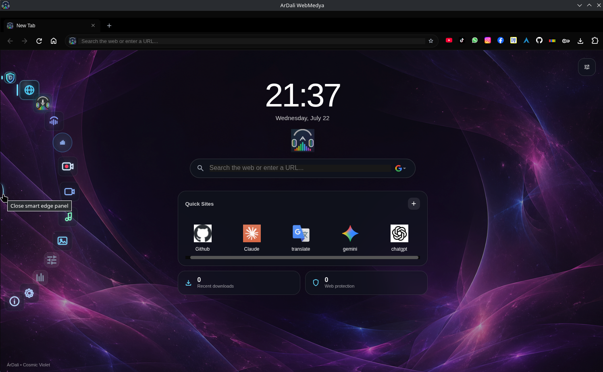
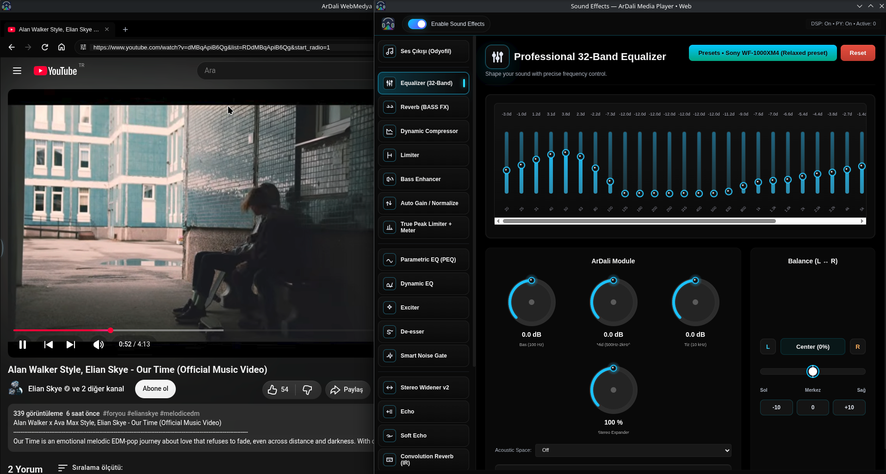
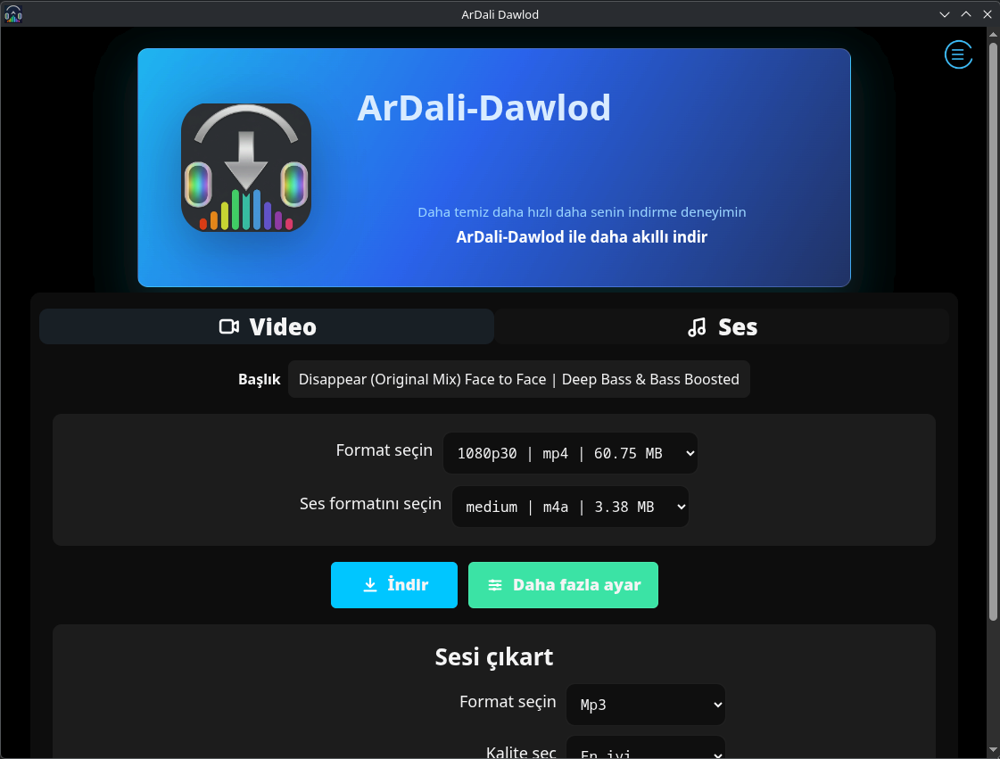
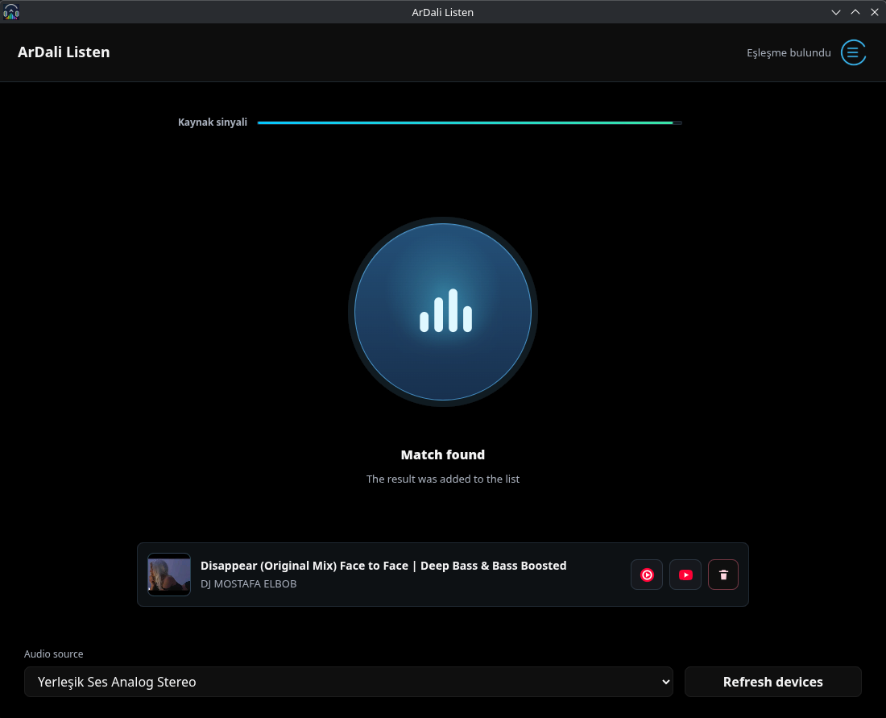
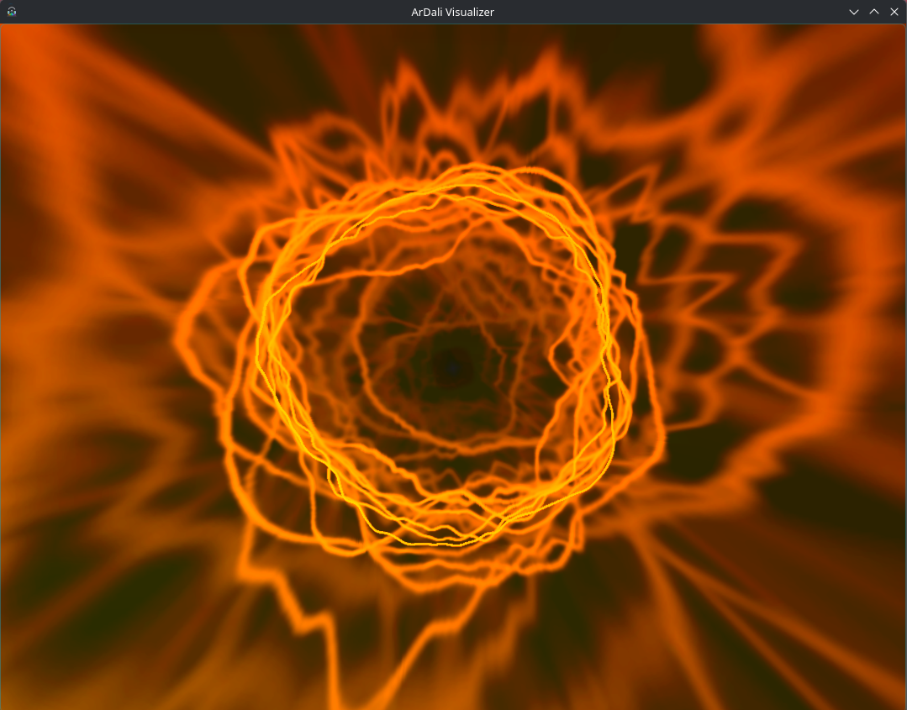
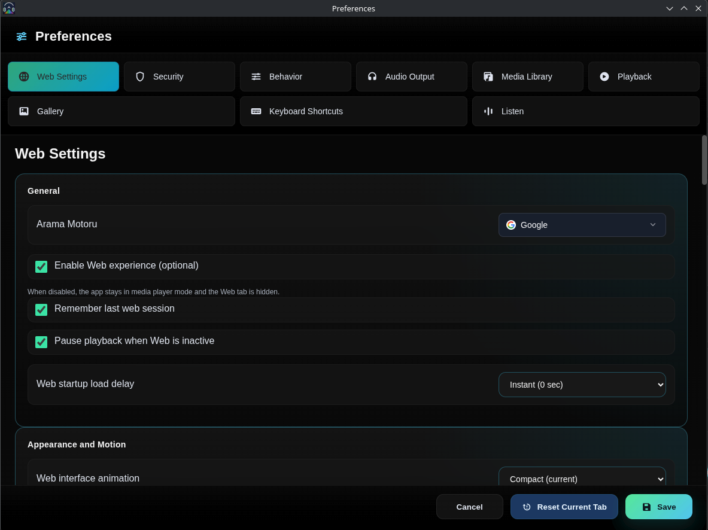

# ArDali WebMedia

<p align="center">
  
</p>

<p align="center">
  <strong>A modern, privacy-focused multimedia platform that combines a built-in Chromium browser, native audio technologies, and advanced media tools in one desktop workspace.</strong>
</p>

<p align="center">
  Browse with fewer distractions, shape web and local audio in real time, manage downloads, recognize music, visualize playback, and keep credentials in a local encrypted vault.
</p>

<p align="center">
  <a href="https://muhammed-dali.github.io/ArDali-WebMedia/"></a>
  <a href="https://github.com/Muhammed-Dali/ArDali-WebMedia/releases/latest"></a>
  <a href="https://github.com/Muhammed-Dali/ArDali-WebMedia/actions/workflows/build-linux.yml"></a>
  <a href="https://github.com/Muhammed-Dali/ArDali-WebMedia/actions/workflows/pre-release.yml"></a>
  <a href="https://github.com/Muhammed-Dali/ArDali-WebMedia/releases"></a>
  
  <a href="https://aur.archlinux.org/packages/ardali-bin"></a>
  <a href="LICENSE"></a>
</p>

<p align="center">
  <a href="https://github.com/Muhammed-Dali/ArDali-WebMedia/releases/latest"><strong>Download v5.4.4</strong></a>
  · <a href="#installation">Install</a>
  · <a href="#screenshots">Screenshots</a>
  · <a href="docs/FEATURES.md">Features</a>
  · <a href="CONTRIBUTING.md">Contribute</a>
</p>

> ArDali WebMedia is under active development. For everyday use, prefer a published release over the current `main` branch.

## Screenshots

### 1. Built-in Web Browser

Chromium-based browsing, multiple tabs, quick sites, privacy tools, and media shortcuts in a unified workspace.



### 2. Password Manager

The local-only vault combines AES-256-GCM encryption, a master password, automatic locking, secure autofill, and exact HTTPS origin verification.


### 3. Built-in Ad Blocker

Built-in filtering supports privacy-focused browsing and a cleaner web experience with selectable protection levels and filter lists.


### 4. Web Audio Effects

A flagship workflow: process web playback with the Native C++ Audio Engine and Dali Web Audio Engine through real-time DSP and professional audio controls.



### 5. Smart Downloader

Automatic URL detection, audio and video downloads, format selection, and support for multiple compatible platforms.



### 6. Music Recognition

Shazam-like recognition detects music directly from webpages and presents matches quickly inside the application.



### 7. projectM Visualizer

Real-time, natively integrated projectM visualization with hardware-accelerated rendering.



### 8. Settings

Centralized controls for the multilingual interface, security and privacy behavior, media features, and application preferences.



## Features at a glance

| Area | Highlights |
| --- | --- |
| 🌐 **Browser** | Chromium browser, multiple tabs, new-tab workspace, built-in ad blocker |
| 🔐 **Security** | Local password vault, AES-256-GCM, secure autofill, automatic lock, HTTPS origin validation |
| 🎵 **Audio** | Native C++ Audio Engine, Dali Web Audio Engine, 32-band EQ, real-time DSP and audio effects |
| ⬇ **Downloader** | Smart URL detection, audio/video downloads, format and quality selection |
| 🎨 **Visualizer** | Native projectM integration and hardware-accelerated real-time rendering |
| 🎬 **Multimedia** | Music player, video player, photo gallery, screen recorder and playlists |
| 🌍 **Localization** | Multi-language interface with locale packs and RTL-aware surfaces |
| ⚡ **Performance** | Native components, optimized startup paths, lazy UI work and sandboxed renderers |

See the complete [feature guide](docs/FEATURES.md).

## Security

ArDali uses Chromium sandboxing, context isolation, strict Content Security Policies, validated IPC boundaries, and a local-only password vault. Credential autofill is limited to verified HTTPS origins and short-lived user-authorized operations. Automated checks include Electron security tests, credential-vault tests, `npm audit`, and CI security workflows.

These controls reduce risk; they are not a claim that the application is vulnerability-free. Read the [security model](docs/SECURITY.md) and use the private process in [SECURITY.md](SECURITY.md) to report a vulnerability.

## Audio engines

Local playback can use the native C++ engine and its real-time DSP chain, while web playback uses the Dali Web Audio Engine to build controlled audio-processing graphs. This provides application-level EQ, dynamics, spatial, and restoration tools beyond the controls normally exposed by a webpage.

Read [Audio Engine](docs/AUDIO_ENGINE.md) for the processing model and boundaries.

## Dali language

ArDali includes a small audio DSL for `.dali` and `.dl` presets, with a compiler, guarded runtime targets, command-line tooling, and a VS Code extension.

```dali
preset "Clean Boost" {
  input web;
  output speakers;
  chain { preamp gain=2db; limiter ceiling=-1db; }
}
```

Read [Dali Language](docs/DALI_LANGUAGE.md) for supported syntax, compiler targets, validation, and editor setup.

## Architecture

```text
Browser and Media UI
          ↓
Electron + isolated preload bridges
          ↓
Native C++ Audio Engine + Dali Web Audio Engine
          ↓
Real-time DSP processing
          ↓
Audio output and projectM visualization
```

See the full [architecture overview](docs/ARCHITECTURE.md).

## Installation

### Arch Linux and derivatives (AUR)

Install the published binary package with an AUR helper:

```bash
yay -S ardali-bin
```

Review the [AUR package page](https://aur.archlinux.org/packages/ardali-bin) before installation. AUR packages are community build recipes and are not installed by `pacman` alone.

### AppImage, DEB, and RPM

Download the package for your distribution from [GitHub Releases](https://github.com/Muhammed-Dali/ArDali-WebMedia/releases/latest). Verify artifacts with the published `SHA256SUMS.txt`; see [release verification](docs/RELEASES.md#verify-a-download).

```bash
chmod +x ArDali-*-linux-*.AppImage
./ArDali-*-linux-*.AppImage
```

Some distributions require FUSE 2 for AppImage execution. See [troubleshooting](docs/TROUBLESHOOTING.md) if the application does not start.

### Flatpak

Flatpak metadata and automated validation are included. Flathub publication is pending review, so follow the documented [local Flatpak build](packaging/flatpak/README.md).

## Build from source

ArDali combines desktop UI code, a native audio addon, and a C++ projectM visualizer. Install the documented system dependencies before building.

```bash
git clone https://github.com/Muhammed-Dali/ArDali-WebMedia.git
cd ArDali-WebMedia
npm ci
npm --prefix native ci
npm start
```

Read [Building from source](docs/BUILDING.md) for native dependencies, supported commands, Linux packaging, and Windows guidance.

## Documentation

- [Features](docs/FEATURES.md)
- [Architecture](docs/ARCHITECTURE.md)
- [Security model](docs/SECURITY.md)
- [Audio Engine](docs/AUDIO_ENGINE.md)
- [Dali Language](docs/DALI_LANGUAGE.md)
- [Building from source](docs/BUILDING.md)
- [Linux packaging](docs/PACKAGING.md)
- [Release and artifact verification](docs/RELEASES.md)
- [Troubleshooting](docs/TROUBLESHOOTING.md)
- [Brand and visual assets](docs/BRAND_ASSETS.md)

## Contributing and credits

Bug reports, documentation improvements, translations, packaging fixes, and focused code contributions are welcome. Start with [CONTRIBUTING.md](CONTRIBUTING.md), follow the [Code of Conduct](CODE_OF_CONDUCT.md), and review the repository's [contributors](https://github.com/Muhammed-Dali/ArDali-WebMedia/graphs/contributors).

ArDali is built with open-source technologies and third-party runtime components. Their licenses and binary provenance remain documented in [THIRD_PARTY_BINARIES.md](THIRD_PARTY_BINARIES.md). Project changes and release history are preserved in the [changelog](CHANGELOG.md) and [release notes](https://github.com/Muhammed-Dali/ArDali-WebMedia/releases).

## Community and support

- [Bug reports and feature requests](https://github.com/Muhammed-Dali/ArDali-WebMedia/issues)
- [Roadmap](ROADMAP.md)
- [Changelog](CHANGELOG.md)
- [Security reporting](SECURITY.md)

When asking for help, include the ArDali version, distribution, desktop session (X11 or Wayland), package type, and relevant logs with secrets removed.

## Legal

ArDali WebMedia is distributed under the [GNU General Public License v3.0](LICENSE). Bundled third-party components remain subject to their respective licenses.

Third-party service names and trademarks belong to their respective owners. ArDali WebMedia is not affiliated with or endorsed by those services. Users are responsible for complying with applicable laws and service terms when accessing or downloading media.

## Recommended GitHub topics

Repository maintainers may consider: `electron`, `chromium`, `browser`, `media-player`, `audio`, `audio-engine`, `cpp`, `multimedia`, `music`, `video`, `password-manager`, `security`, `visualizer`, `projectm`, `linux`, `windows`, `cross-platform`, `privacy`, `dsp`.
