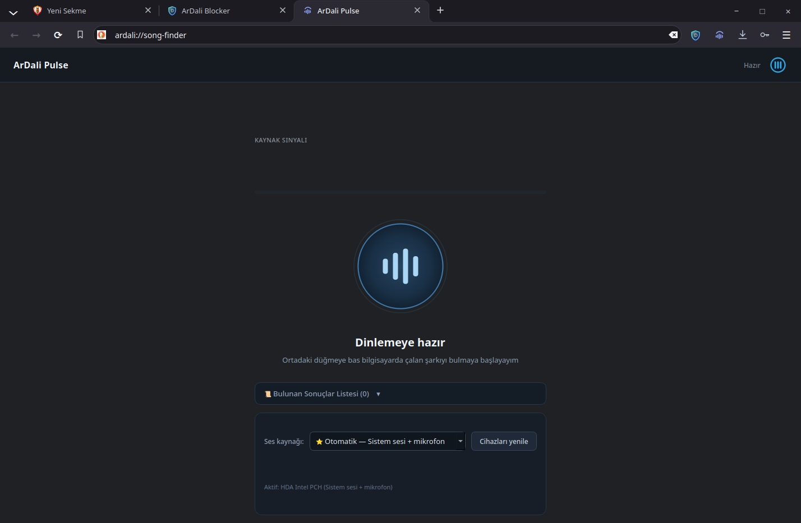
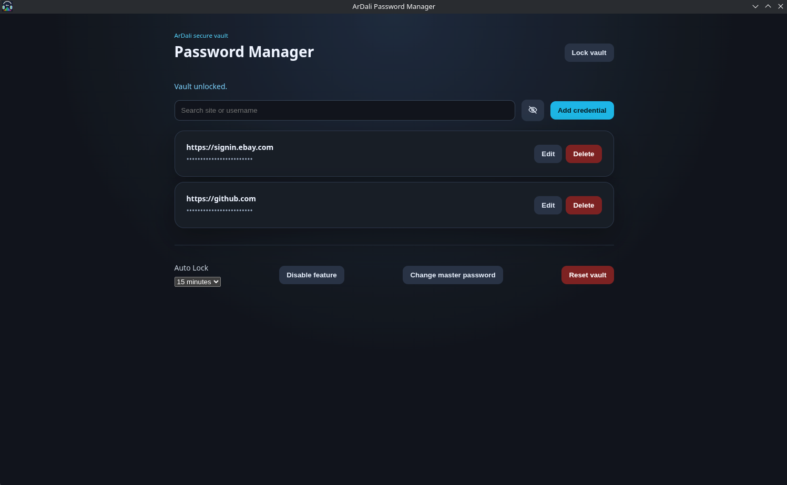
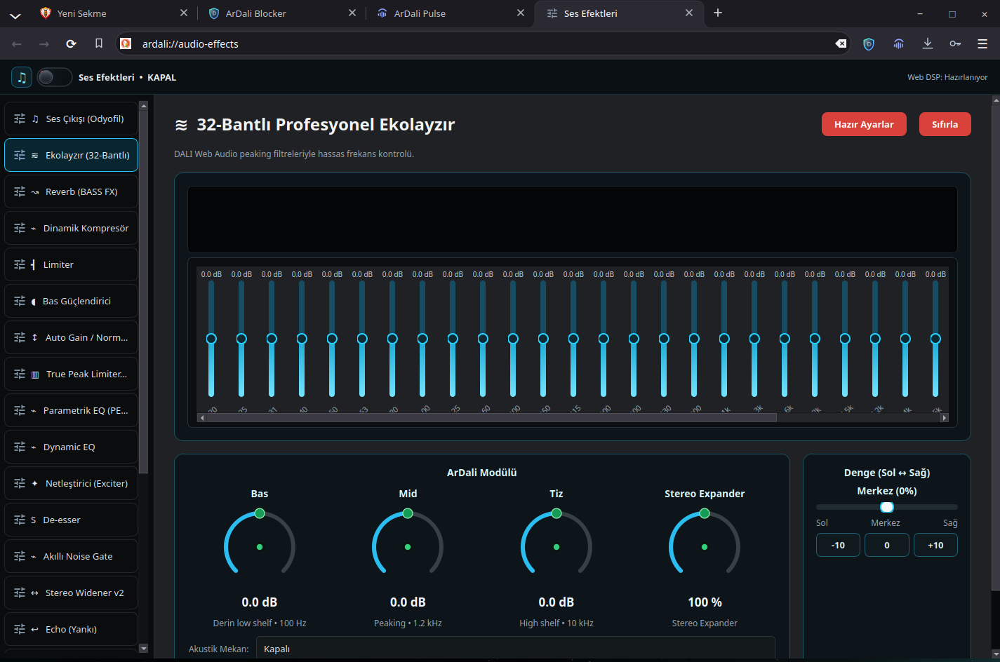

<p align="center">
  
</p>

<h1 align="center">ArDali Browser</h1>

<p align="center">
  A native, privacy-oriented desktop browser with integrated media tools.
</p>

<p align="center">
  <a href="https://github.com/Muhammed-Dali/ArDali-Browser/actions/workflows/ci.yml"></a>
  <a href="https://github.com/Muhammed-Dali/ArDali-Browser/releases/tag/v6.0.1"></a>
  <a href="LICENSE"></a>
  
  
</p>

## About

ArDali Browser is an open-source desktop browser built with C++20, Qt 6, and
Qt WebEngine. It combines modern tabbed browsing with local privacy controls,
media-focused audio processing, music recognition, and an encrypted credential
vault. Linux is the verified release platform for version 6.0.1.

## Highlights

- **Native browsing:** Qt WebEngine rendering in a native Qt Widgets shell.
- **Modern tabs:** Reordering, detachable tabs, hover previews, session
  restoration, and internal application pages.
- **ArDali Blocker:** ArDali Browser's built-in advertising and tracker
  protection system, with site-specific controls, configurable filter lists,
  cosmetic and extended filtering, and logs.
- **ArDali Pulse:** Identify music captured from system audio or a microphone
  and open matching results on configured music services.
- **Password Manager:** Encrypted local credential vault with explicit unlock
  and fill controls.
- **Audio tools:** Output processing, equalizer presets, compressor, limiter,
  bass enhancement, and automatic gain controls.
- **Custom new tab:** Search, shortcuts, cards, background choices, and layout
  controls.
- **Browser settings:** Native settings for browsing, privacy, content,
  passwords, Pulse, downloads, accessibility, and appearance.

## Screenshots

### Native browsing

The main browser window uses native chrome, multi-tab navigation, and Qt
WebEngine content rendering.


### ArDali Blocker

ArDali Blocker is ArDali Browser's built-in advertising and tracker protection
engine. Its native filtering engine is developed as part of ArDali Browser.

It provides network filtering, tracker protection, site-specific controls,
configurable filter lists, cosmetic and extended filtering, logs, and developer
inspection through the built-in blocker interface.


### ArDali Pulse

Recognize music from system audio or a microphone without leaving the browser.



### Password Manager

Credentials are stored in an encrypted local vault that starts locked.



### Audio effects

Tune browser media with modular output processing and equalizer tools.



## Installation

### Arch Linux and derivatives

#### Install from AUR (recommended)

Install ArDali Browser directly from its
[`ardali` AUR package](https://aur.archlinux.org/packages/ardali):

```bash
yay -S ardali
```

The package name is `ardali`; `ardali-browser` and `ardali-bin` are not needed
in the install command. The AUR package downloads the published native binary
release and installs the `ardali-browser` executable.

#### Install from the ArDali pacman repository

Alternatively, add the ArDali binary repository once and install the same
`ardali` package with pacman:

```bash
curl -fsSL https://muhammed-dali.github.io/ArDali-Browser/ardali.repo | \
  sudo tee -a /etc/pacman.conf
sudo pacman -Syy
sudo pacman -S ardali
```

The repository database and package are hosted remotely; these commands do not
build ArDali from the local source tree.

#### Local source package build

For maintainers who specifically want to compile the Arch package locally, use
the separate source recipe:

```bash
cd packaging/archlinux
makepkg -si
```

The published AUR recipe is kept in
[`packaging/aur/ardali/PKGBUILD`](packaging/aur/ardali/PKGBUILD), and the local
source-build recipe is in
[`packaging/archlinux/PKGBUILD`](packaging/archlinux/PKGBUILD).

### Build from source

Install the native build dependencies for your distribution.

Debian 12 and Ubuntu 24.04 LTS:

```bash
sudo apt install build-essential cmake ninja-build nodejs libssl-dev ffmpeg \
  qt6-base-dev qt6-image-formats-plugins qt6-svg-dev qt6-webengine-dev
```

Fedora:

```bash
sudo dnf install gcc-c++ cmake ninja-build nodejs openssl-devel ffmpeg-free \
  qt6-qtbase-devel qt6-qtimageformats qt6-qtsvg-devel qt6-qtwebengine-devel
```

Arch Linux and derivatives:

```bash
sudo pacman -S --needed base-devel cmake ninja nodejs openssl ffmpeg \
  qt6-base qt6-imageformats qt6-svg qt6-webengine
```

Configure, build, and test:

```bash
cmake -S browser -B browser/build -G Ninja -DCMAKE_BUILD_TYPE=Release
cmake --build browser/build -j"$(nproc)"
ctest --test-dir browser/build --output-on-failure
```

Run the development build:

```bash
./browser/build/ardali-browser
```

Or install into a chosen prefix:

```bash
cmake --install browser/build --prefix /usr/local
```

### Platform status

- **Linux:** Source builds and tests are verified on Debian 12, Ubuntu 24.04
  LTS, Fedora, and Arch Linux. The portable release uses a Debian 12 baseline
  for broader compatibility across current Linux distributions.
- **Windows:** The source tree contains Windows resource integration, but no
  official 6.0.1 Windows artifact is promised until its build pipeline is
  independently verified.

## Project structure

```text
ArDali/
├── browser/
│   ├── native/
│   │   ├── main.cpp
│   │   ├── audio/
│   │   ├── blocker/
│   │   ├── core/
│   │   ├── eq/
│   │   ├── newtab/
│   │   ├── passwords/
│   │   ├── pulse/
│   │   ├── session/
│   │   ├── settings/
│   │   ├── sidebar/
│   │   └── tabs/
│   ├── resources/
│   └── CMakeLists.txt
├── dali-lang/
├── docs/
├── packaging/
└── CMakeLists.txt
```

The DALI toolchain compiles the browser's declarative audio and policy inputs
during the native CMake build.

## Privacy and security

- Blocking and cosmetic filtering are performed locally from bundled rulesets.
- The credential vault encrypts stored records and starts locked.
- Internal pages use explicit capability boundaries in the native tab model.
- ArDali Pulse sends captured fingerprints to its configured recognition
  backend only when recognition is initiated.

No browser can guarantee complete privacy or protection. Review the source,
settings, and enabled rulesets for your environment.

## Contributing

Issues and pull requests are welcome. Please include reproducible steps for bug
reports, run the relevant CTest targets, and avoid committing generated build
output or personal data. Use GitHub's private security-advisory form for
vulnerabilities.

## Support ArDali Browser

ArDali Browser is an independent open-source project. If you find it useful,
you can support its continued development through the Sponsor button.

## License

ArDali Browser is licensed under **GPL-3.0-only**. See [LICENSE](LICENSE) for
the binding license text.

## Third-party components

Bundled third-party filter data, generated rulesets, scriptlets, and resources
retain their respective copyright and license notices. See
[`browser/resources/adblock/NOTICE.txt`](browser/resources/adblock/NOTICE.txt)
for attribution details.
