<p align="center">
  
</p>

<h1 align="center">Aurivo Media Player (Linux)</h1>

<p align="center">
  Müzik, video, web, indirici, dinleyerek şarkı bulma, projectM görselleştirme ve gelişmiş DSP ses efektlerini tek uygulamada birleştiren masaüstü medya platformu.
</p>

<p align="center">
  <a href="https://github.com/muhammed-aurivo-dev/Aurivo-Medya-Player-Linux/releases/latest">
    
  </a>
  <a href="https://github.com/muhammed-aurivo-dev/Aurivo-Medya-Player-Linux/releases">
    
  </a>
  <a href="https://github.com/muhammed-aurivo-dev/Aurivo-Medya-Player-Linux/actions/workflows/release.yml">
    
  </a>
  <a href="LICENSE">
    
  </a>
</p>

<p align="center">
  <a href="https://github.com/muhammed-aurivo-dev/Aurivo-Medya-Player-Linux/releases/latest">
    
  </a>
  <a href="https://github.com/muhammed-aurivo-dev/Aurivo-Medya-Player-Linux/releases/latest">
    
  </a>
  <a href="https://github.com/muhammed-aurivo-dev/Aurivo-Medya-Player-Linux/releases/latest">
    
  </a>
</p>

## Linux Kurulum
- AppImage / `.deb` / `.rpm`: [Latest Release](https://github.com/muhammed-aurivo-dev/Aurivo-Medya-Player-Linux/releases/latest)
- Arch Linux (AUR): `yay -S aurivo-bin`

## Aurivo Nedir?
Aurivo, klasik bir medya oynatıcıdan daha fazlasını hedefler:
- Yerel müzik/video oynatma
- Dahili web medya deneyimi
- Çok modüllü ses işleme (native C++ DSP)
- Dinleyerek şarkı bulma (Aurivo-Pulse)
- Gelişmiş indirici (Aurivo-Dawlod)
- projectM tabanlı canlı görselleştirme

Bu yapı sayesinde kullanıcılar tek uygulamada üretken, modern ve kapsamlı bir medya ekosistemi elde eder.

## Temel Özellikler

### 1) Müzik ve Video Oynatma
- Yerel dosya oynatma
- Çalma listesi yönetimi
- Çalma kontrolleri (play/pause, ileri/geri, tekrar, karıştır)
- Kütüphane odaklı kullanım

### 2) Dinleyerek Şarkı Bulma (Aurivo-Pulse)
- Çalan sesi dinleyip şarkı tespiti akışı
- Hızlı dinleme modu ve tercih ekranı
- Tanıma sürecinde kullanıcıya net geri bildirim

### 3) Web Medya Modu
- Uygulama içi web sekmesi
- Medya odaklı platform kullanımı için tek arayüz
- Güvenlik ve gizlilik kontrolleri ile uyumlu yapı

### 4) İndirme Modülü (Aurivo-Dawlod)
- Video/ses indirme senaryoları
- Format, kalite ve çıktı kontrolü
- Ayrı modül mimarisi ile ana uygulamadan temiz ayrım

### 5) projectM Görselleştirici
- Native `projectM` görselleştirme altyapısı
- Gerçek zamanlı görsel sahneler ve preset akışı
- Performans odaklı harici görselleştirici bileşeni

### 6) Gelişmiş Ses Efektleri (DSP)
- Native C++ ses motoru (BASS + DSP zinciri)
- 32 bant EQ ve preset sistemi
- Kompresör, limiter, reverb, crossfeed, surround, true-peak vb. modüller
- Efekt ayarlarının kalıcı saklanması ve UI senkronizasyonu

## Ses Efekt Modül Haritası
Aurivo ses işleme tarafında kapsamlı bir modül seti sunar:
- Ekolaycı (32-Bant)
- Reverb (BASS FX)
- Dinamik Kompresör
- Limiter
- Bas Güçlendirici
- Akıllı Noise Gate
- De-esser
- Exciter
- Stereo Widener v2
- Echo / Saf Echo
- Konvolüsyon Reverb (IR)
- Parametrik EQ (PEQ)
- Auto Gain / Normalize
- True Peak Limiter + Meter
- Crossfeed (Kulaklık)
- Surround (5.1/7.1 Simülasyon)
- Bass Mono
- Dynamic EQ
- Tape Saturation
- Bit-depth / Dither

## Çoklu Dil Desteği
Uygulama çok dilli çalışır ve sistem dili ile uyumlu davranabilir.

Desteklenen diller (örnek):
- Turkish (`tr-TR`)
- English (`en-US`)
- Arabic (`ar-SA`)
- German (`de-DE`)
- Spanish (`es-ES`)
- French (`fr-FR`)
- Italian (`it-IT`)
- Portuguese (`pt-BR`)
- Russian (`ru-RU`)
- Chinese Simplified/Traditional (`zh-CN`, `zh-TW`)
- ve diğerleri (`locales/` altında)

Detay: [LOCALE-COVERAGE.md](LOCALE-COVERAGE.md)

## Ekran Görüntüleri

### Ana Arayüz
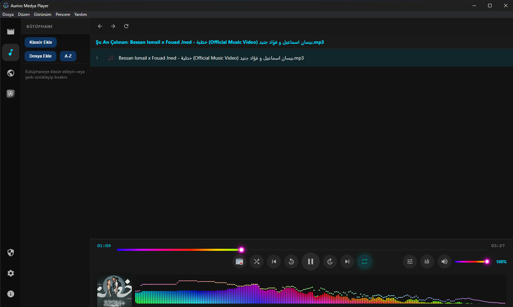

### Ses Efektleri (DSP)
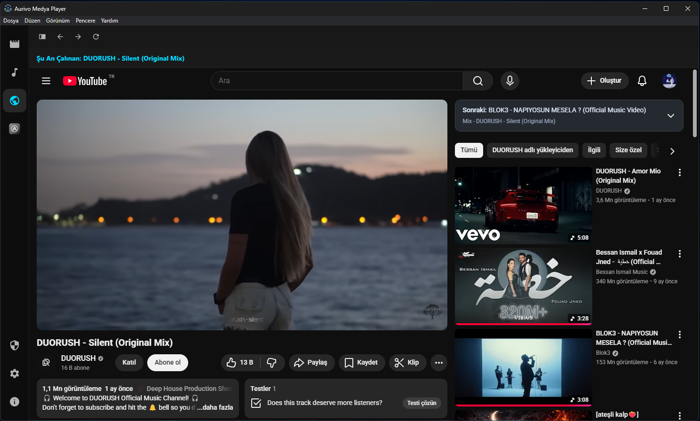

### Dinleyerek Şarkı Bulma / Modüler Arayüz
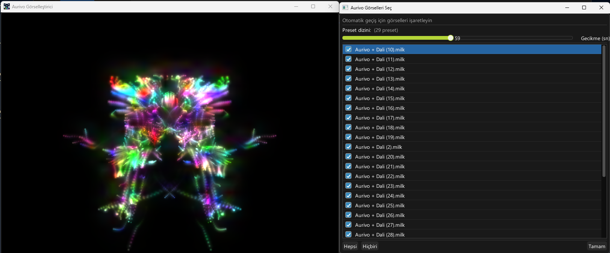

### projectM Görselleştirici
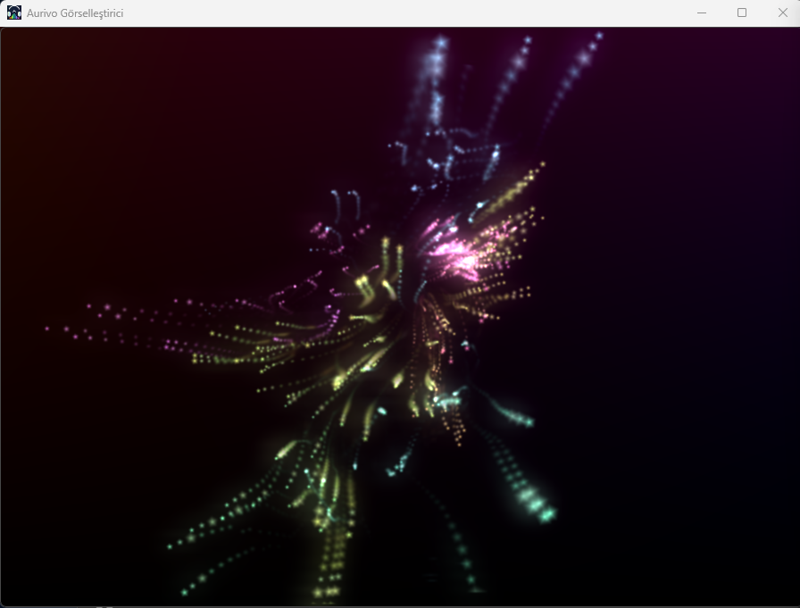

### İndirme Modülü
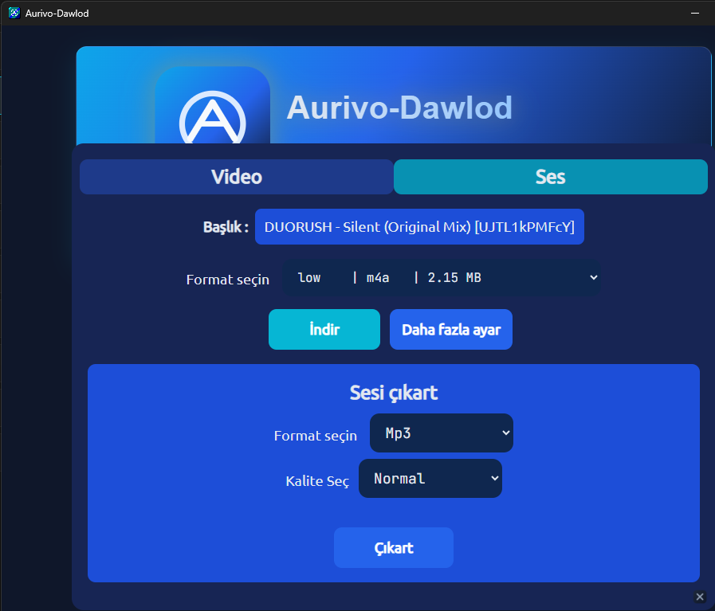

<details>
<summary>Daha fazla ekran görüntüsü</summary>

- 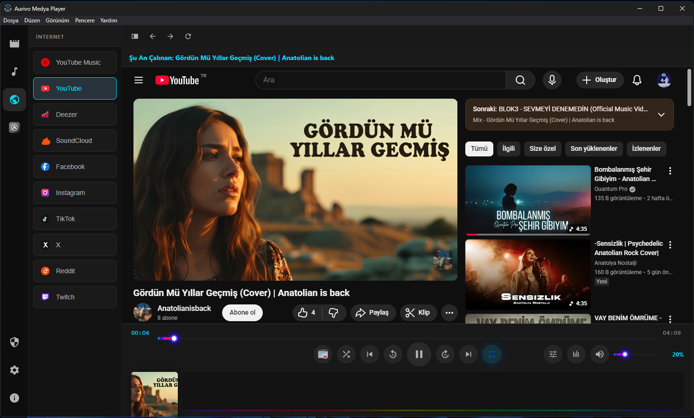
- 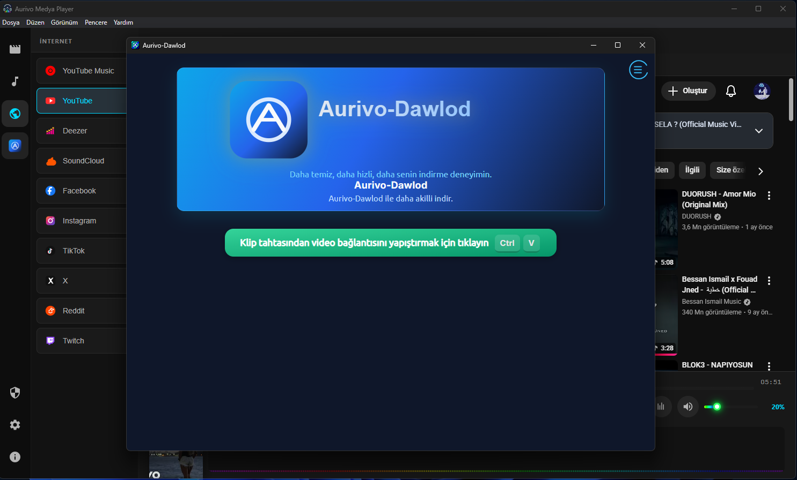
- 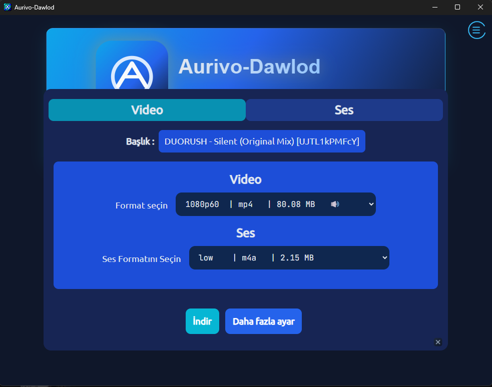
- 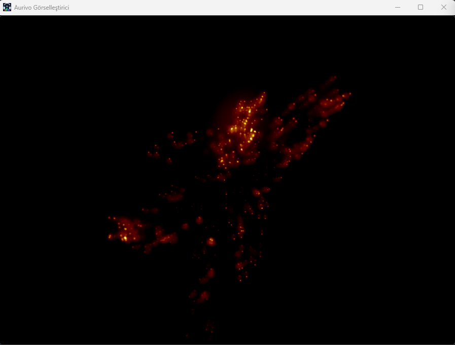
- 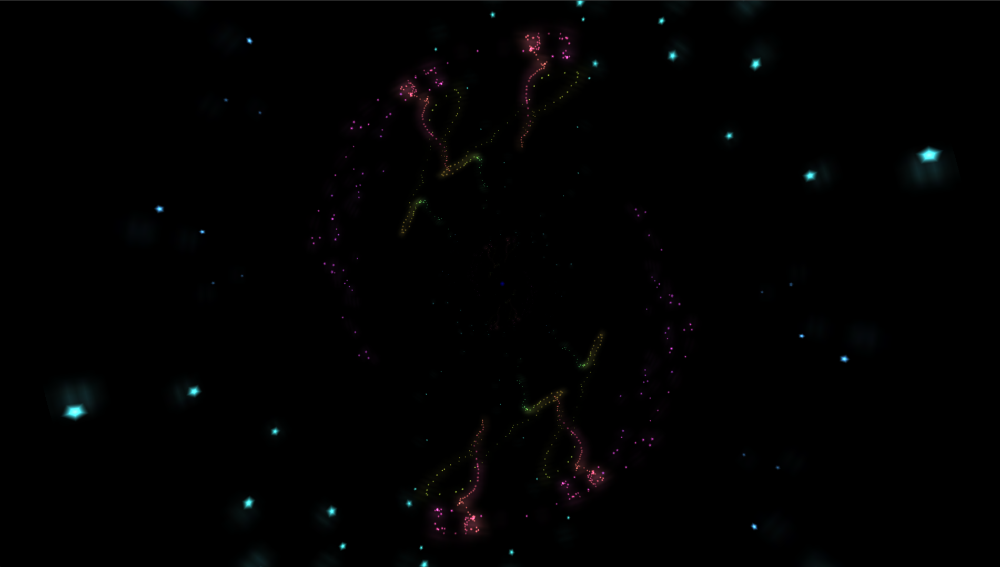
- 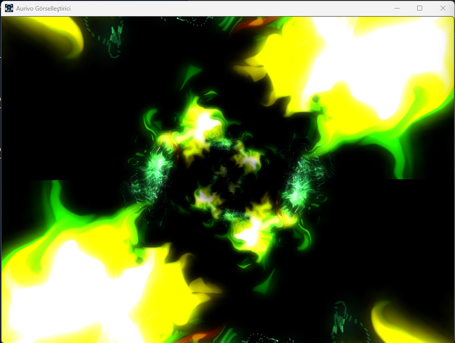

</details>

## Kurulum ve Paketler
En güncel paketler için: [Releases](https://github.com/muhammed-aurivo-dev/Aurivo-Medya-Player-Linux/releases/latest)

Linux paketleri:
- `AppImage` (geniş dağıtım uyumluluğu)
- `.deb` (Debian/Ubuntu tabanlı)
- `.rpm` (Fedora/openSUSE tabanlı)

## Hızlı Başlangıç (Geliştirici)
```bash
npm ci
npm --prefix native ci
cmake -S visualizer -B build-visualizer -G Ninja -DCMAKE_BUILD_TYPE=Release
cmake --build build-visualizer
npm run build:linux
```

## Proje Yapısı (Özet)
- `renderer.js`, `main.js`, `preload.js`: Electron uygulama katmanı
- `native/`: C++ native audio engine
- `soundEffectsRenderer.js`: DSP arayüz ve kontrol katmanı
- `visualizer/`: projectM görselleştirici bileşeni
- `Aurivo-Pulse/`: dinleyerek şarkı bulma modülü
- `Aurivo-Dawlod/`: indirme modülü
- `locales/`: çeviri dosyaları

## Bilinen Davranış
Bazı USB/kulaklık ses cihazlarında bağlantı kesildiğinde sistem varsayılan çıkış rotası değişebilir ve oynatma durabilir. Kullanıcı play ile devam edebilir.

## Katkı
- Hata/öneri: Issues
- PR: [CONTRIBUTING.md](CONTRIBUTING.md)

## Lisans
MIT - detaylar için [LICENSE](LICENSE)
