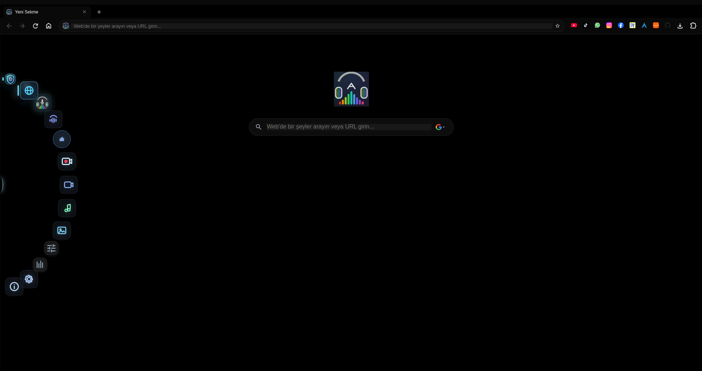
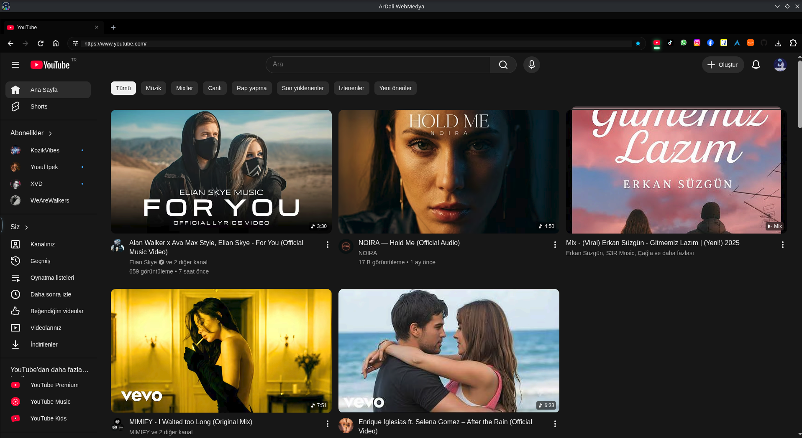
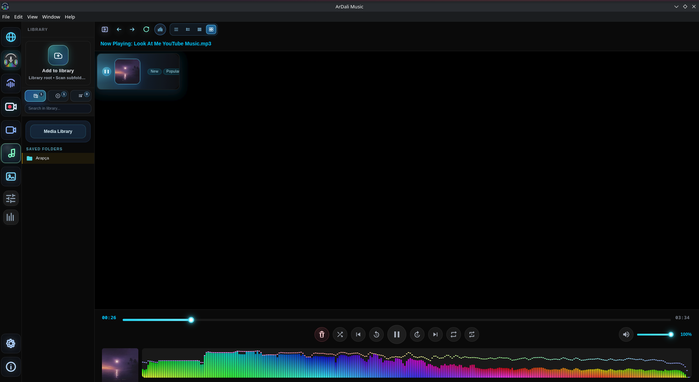
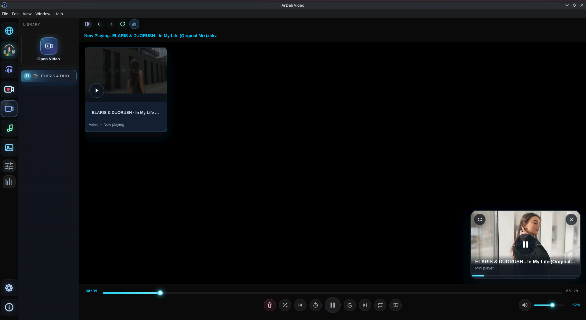
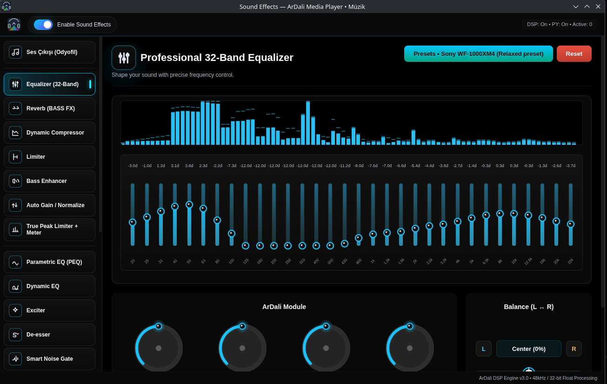

# ArDali WebMedia

<p align="center">
  
</p>

<p align="center">
  A feature-rich open-source desktop media workspace for Linux, with local audio and video playback, web media, DSP effects, a 32-band equalizer, projectM visualizations, downloads, screen recording, and music recognition.
</p>

<p align="center">
  <a href="https://muhammed-dali.github.io/ArDali-WebMedia/"></a>
  <a href="https://github.com/Muhammed-Dali/ArDali-WebMedia/releases/latest"></a>
  <a href="https://github.com/Muhammed-Dali/ArDali-WebMedia/actions/workflows/build-linux.yml"></a>
  <a href="https://github.com/Muhammed-Dali/ArDali-WebMedia/releases"></a>
  <a href="https://aur.archlinux.org/packages/ardali-bin"></a>
  <a href="https://github.com/Muhammed-Dali/ArDali-WebMedia/stargazers"></a>
  <a href="LICENSE"></a>
</p>

<p align="center">
  <a href="https://github.com/Muhammed-Dali/ArDali-WebMedia/releases/latest"><strong>Download v5.4.2</strong></a>
  · <a href="https://muhammed-dali.github.io/ArDali-WebMedia/">Website</a>
  · <a href="#installation">Install</a>
  · <a href="CONTRIBUTING.md">Contribute</a>
</p>

> ArDali WebMedia is under active development. For production use, install a published release instead of running the `main` branch.

## Highlights

- Local music and video playback with broad format support
- Hardware-aware Dali Audio Engine, DSP effects, and a 32-band equalizer
- Hardware-accelerated projectM visualizer
- Integrated web media workspace with DeliBlock filtering
- Media downloads and local format conversion
- Screen recording, music recognition, gallery, playlists, and MPRIS integration
- Localized interface with multiple language packs
- Linux packages including AppImage, DEB, RPM, and an AUR package

## 🔐 Password Manager

ArDali's password manager stores credentials only on the local device; credentials are never uploaded to a server. The credential vault is encrypted with AES-256-GCM, integrates with the operating system's secure key storage, and is protected by a master password with configurable automatic locking.

Credential storage and autofill are restricted to HTTPS pages with exact origin matching. Autofill requires user interaction and uses short-lived, single-use authorization so credentials cannot be silently requested by a page. Legacy vault data is migrated automatically to the current encrypted format after a successful unlock.

## 🛡 Security

### Electron security

- Chromium sandboxing, context isolation, and disabled Node.js integration
- Hardened `BrowserWindow` settings, a strict Content Security Policy, and DOMPurify sanitization
- Centralized IPC validation with role-based channel permissions
- Restricted site permissions and securely validated external protocol handling

### Password security

- AES-256-GCM encryption backed by secure OS key storage
- Brute-force protection with progressive unlock delays
- Configurable automatic locking and short-lived authorization tokens
- Secure memory handling that clears sensitive key and plaintext buffers

## 🔄 Secure Release Pipeline

Every versioned release must pass the automated pre-release security gate before publication. The gate runs `npm audit`, Electron Security Tests, Credential Vault Tests, Binary Manifest Verification, Release Metadata Verification, and the Security Suite before the application is built and packaged.

If any critical security check fails, the workflow stops automatically: no GitHub Release or AUR/Pacman package is published.

## Demo and screenshots



> A short, silent 15–25 second demo GIF should be placed here after it is captured from a release build. The production brief and export limits are documented in [Brand and visual assets](docs/BRAND_ASSETS.md#demo-gif).

| Web media | Music player |
| --- | --- |
|  |  |

| Video player | Audio effects |
| --- | --- |
|  |  |

Additional interfaces: [downloader](assets/screenshots/downloader.png), [screen recorder](assets/screenshots/screen_recorder.png), [music recognition](assets/screenshots/song_recognition.png), [gallery](assets/screenshots/gallery.png), [visualizer](assets/screenshots/visualizer.png), and [ad blocker](assets/screenshots/adblocker.png).

## Installation

### Arch Linux and derivatives (AUR)

Install the published binary package with an AUR helper:

```bash
yay -S ardali-bin
```

Review the [AUR package page](https://aur.archlinux.org/packages/ardali-bin) before installation. AUR packages are community build recipes and are not installed by `pacman` alone.

### AppImage, DEB, and RPM

Download the package for your distribution from [GitHub Releases](https://github.com/Muhammed-Dali/ArDali-WebMedia/releases/latest). Verify downloaded artifacts with the release `SHA256SUMS.txt`; see [release verification](docs/RELEASES.md#verify-a-download).

For AppImage:

```bash
chmod +x ArDali-*-linux-*.AppImage
./ArDali-*-linux-*.AppImage
```

Some distributions require FUSE 2 for AppImage execution. See [troubleshooting](docs/TROUBLESHOOTING.md) if the application does not start.

### Flatpak

Flatpak packaging metadata and automated validation are available in the repository. Flathub publication is still pending review, so use the documented [local Flatpak build](packaging/flatpak/README.md) instead of treating it as a published store package.

## Build from source

ArDali includes Electron/Node.js components, a native audio addon, and a C++ projectM visualizer. A complete build therefore needs more than a normal `npm install`.

```bash
git clone https://github.com/Muhammed-Dali/ArDali-WebMedia.git
cd ArDali-WebMedia
npm ci
npm --prefix native ci
npm start
```

The development command is Linux-oriented and uses project-specific runtime paths. Read [Building from source](docs/BUILDING.md) for system dependencies, native build steps, and supported commands.

## Documentation

- [Building from source](docs/BUILDING.md)
- [Architecture overview](docs/ARCHITECTURE.md)
- [Linux packaging](docs/PACKAGING.md)
- [Release and artifact verification](docs/RELEASES.md)
- [Security model](docs/SECURITY.md)
- [Troubleshooting](docs/TROUBLESHOOTING.md)
- [Project audit and maintainer recommendations](docs/PROJECT_AUDIT.md)
- [Brand, banner, and demo guidance](docs/BRAND_ASSETS.md)

## Contributing

Bug reports, documentation improvements, translations, packaging fixes, and focused code contributions are welcome. Start with [CONTRIBUTING.md](CONTRIBUTING.md) and use the repository's issue forms.

Please report suspected vulnerabilities privately as described in [SECURITY.md](SECURITY.md), not in a public issue.

## Community and support

- [Bug reports and feature requests](https://github.com/Muhammed-Dali/ArDali-WebMedia/issues)
- [Roadmap](ROADMAP.md)
- [Changelog](CHANGELOG.md)
- [Code of Conduct](CODE_OF_CONDUCT.md)

When asking for help, include the ArDali version, distribution, desktop session (X11 or Wayland), package type, and relevant logs with secrets removed.

## Legal

ArDali WebMedia is distributed under the [GNU General Public License v3.0](LICENSE). Bundled third-party components remain subject to their respective licenses. See [third-party binary provenance](THIRD_PARTY_BINARIES.md) for tracked native runtime files.

Third-party service names and trademarks belong to their respective owners. ArDali WebMedia is not affiliated with or endorsed by those services. Users are responsible for complying with applicable laws and service terms when accessing or downloading media.
