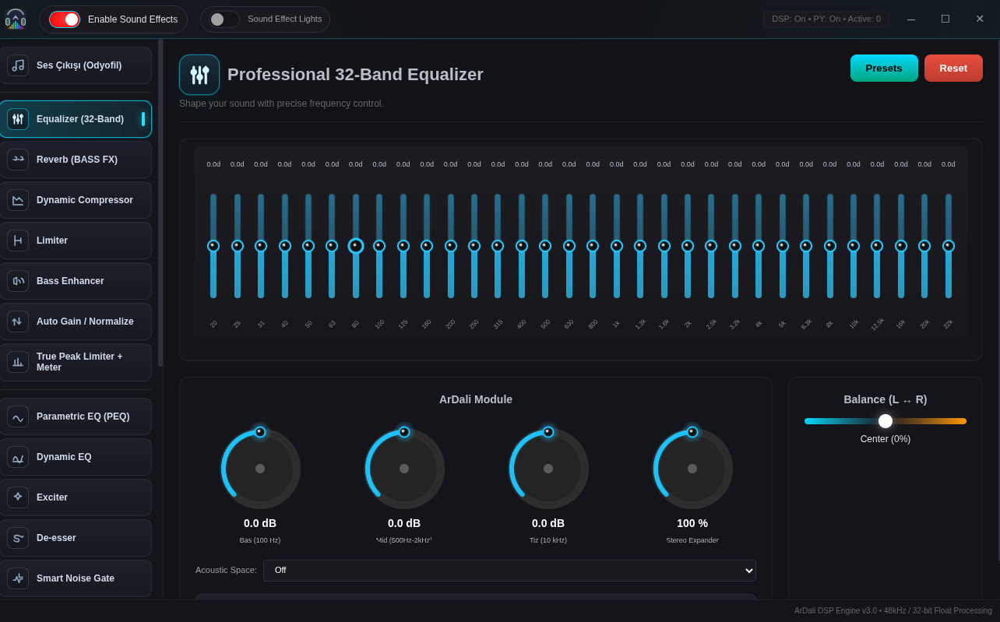
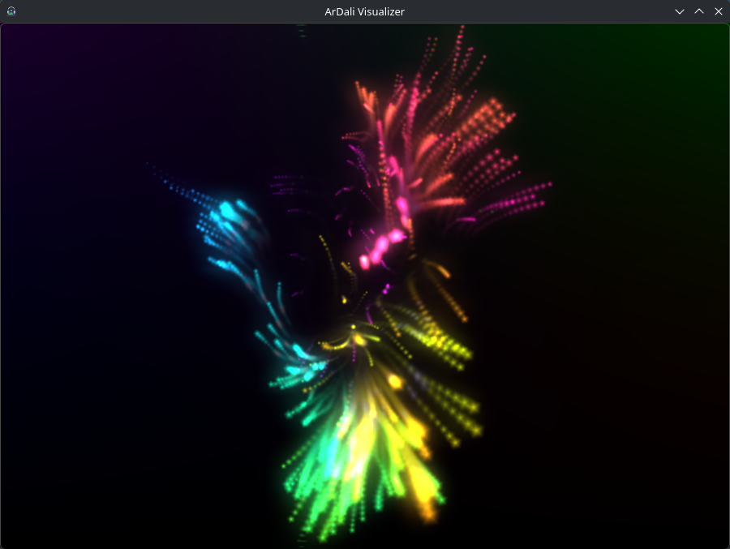

<p align="center">
  
</p>

<p align="center">
  <a href="#english">English</a> | <a href="#turkce">Türkçe</a>
</p>

<p align="center">
  <a href="https://github.com/muhammed-ardali-dev/ArDali-Medya-Player-Linux">
    
  </a>
  <a href="https://github.com/muhammed-ardali-dev/ArDali-Medya-Player-Linux">
    
  </a>
  <a href="https://github.com/muhammed-ardali-dev/ArDali-Medya-Player-Linux/actions">
    
  </a>
  <a href="https://github.com/muhammed-ardali-dev/ArDali-Medya-Player-Linux/blob/main/LICENSE">
    
  </a>
</p>

<p align="center">
  <a href="https://github.com/muhammed-ardali-dev/ArDali-Medya-Player-Linux/releases/latest">
    
  </a>
  <a href="https://github.com/muhammed-ardali-dev/ArDali-Medya-Player-Linux/releases/latest">
    
  </a>
  <a href="https://github.com/muhammed-ardali-dev/ArDali-Medya-Player-Linux/releases/latest">
    
  </a>
</p>

<p align="center">
  
</p>

## English

### ArDali (v3.0.0) 🚀

Linux media player, web audio engine, music/video downloader, screen recorder, and projectM visualizer in one optimized desktop application.

ArDali is an advanced Electron-based multimedia ecosystem for Linux, designed around strong optimization principles. After 2 years of continuous and intensive development, its infrastructure and architecture have been fully renewed with the v3.0.0 release.

At the heart of the application is a custom-built technology layer that processes web-based audio streams with zero-latency behavior.

Keywords: Linux media player, Linux music player, Linux video player, Electron media player, YouTube downloader for Linux, audio equalizer, 32-band EQ, Shazam-like song recognition, screen recorder for Linux, OBS-style recorder, projectM visualizer, web audio engine, ad blocker browser, AppImage media player, DEB media player, RPM media player.

## AI Audit Statement

This project was developed with active AI assistance.

> **Although all code was generated with AI support, every line was personally reviewed before release and validated with security and performance testing.**

In line with Linux community standards, all technical and legal responsibility for this project belongs to the developer, Muhammed.

## Advanced Highlights

### 1. Custom Dali Audio Engine & `dali-lang` Core Engine

This is the most demanding and innovative part of the project. ArDali includes a built-in web audio engine powered by **`dali-lang`**, a custom programming language developed and compiled specifically for this project.

- Captures audio streams from web resources using `.dali` and `.dl` formats in real time.
- Provides hardware-level **32-band equalizer (EQ)** support for instant sound manipulation.
- Its most critical feature is **zero-latency** audio processing.

### 2. High System Optimization

ArDali challenges the common idea that Electron applications must consume heavy system resources.

- Intensive code optimizations keep the application lightweight while idle or during music playback.
- Even during high-quality video playback, memory usage is designed to stay around a **maximum of 700 MB RAM**.

### 3. Smart Song Recognition by Listening

ArDali can identify music playing in the environment or on the system through advanced acoustic fingerprinting, similar to an integrated Shazam-like workflow.

### 4. Advanced Media Downloader & Converter for Linux

ArDali can download video and music from popular social and media platforms, including YouTube and others, with a focused one-click workflow.

- Downloaded content can be converted locally into different audio and video formats at high speed.

### 5. Secure Ad Blocker Browser Experience

While using web-based platforms or browsing social media, ArDali automatically filters risky ads, trackers, and pop-ups that can harm the user experience or security.

### 6. projectM Visualization Integration

ArDali offers hardware-accelerated visual effects that dynamically react to the rhythm, frequency, and energy of the currently playing music.

### 7. OBS-Style Linux Screen Recorder & Broadcaster Mode

ArDali includes built-in screen recording infrastructure for developers, educators, and content creators who produce YouTube or tutorial content.

- Captures the screen while optionally overlaying an integrated webcam layer.
- Works with an OBS Studio-like scene/source model, optimized for quickly recording and saving content.

### 8. Social Platform & Web Integration

Popular social media and video platforms are brought together under a single fluid interface, reducing the need to switch to an external browser.

### 9. Advanced Linux Music Player

Manage local music libraries with smart metadata handling, playlists, album art, and rich playback controls.

### 10. Linux Video Player

Play local videos in a modern, smooth, and performance-focused interface with broad codec support.

## Binary Provenance & Integrity

This repository includes a limited set of native shared libraries (`.so` / `.so.*`) used by runtime and packaging.

- Provenance list: `THIRD_PARTY_BINARIES.md`
- Pinned hash manifest: `third_party/binary-manifest.json`
- Integrity check: `npm run verify:binary:manifest`

Release artifact checksum/signature flow is documented in `RELEASE-SIGNING.md`.

## Screenshots

<details>
  <summary>View screenshots</summary>
  <br/>
  <table>
    <tr>
      <td></td>
      <td></td>
    </tr>
    <tr>
      <td></td>
      <td></td>
    </tr>
    <tr>
      <td></td>
      <td></td>
    </tr>
    <tr>
      <td></td>
      <td></td>
    </tr>
    <tr>
      <td></td>
      <td></td>
    </tr>
  </table>
</details>

## Installation

To clone and run the project locally:

```bash
git clone https://github.com/Muhammed-Dali/ArDali-WebMedia.git
cd ArDali-WebMedia
npm install
npm start
```

Primary installation instruction for Arch-based Linux systems:

```bash
yay -S ardali-bin
```

For other distributions, follow the latest packages and releases on the GitHub release page.

## Packages and Support

- Linux packages: `AppImage`, `.deb`, `.rpm` (see [latest releases](https://github.com/muhammed-ardali-dev/ArDali-Medya-Player-Linux/releases/latest))
- Bug reports and feature requests: [Issues](https://github.com/muhammed-ardali-dev/ArDali-Medya-Player-Linux/issues)
- Contribution guide: [CONTRIBUTING.md](CONTRIBUTING.md)

## Known Behavior

On some USB/headset audio devices, disconnecting the device may switch the system output route and pause playback. Playback can continue by pressing play again.

## License

This project is released under the MIT License. See [LICENSE](LICENSE) for details.

---

## Turkce

### ArDali (v3.0.0) 🚀

Linux için medya oynatıcı, web ses motoru, müzik/video indirici, ekran kaydedici ve projectM görselleştirici tek bir optimize masaüstü uygulamasında birleşir.

ArDali, Linux sistemler için geliştirilmiş; üstün optimizasyon ilkeleriyle tasarlanmış, Electron tabanlı gelişmiş bir multimedya ekosistemidir. 2 yıllık kesintisiz ve yoğun bir geliştirme sürecinin ardından, tüm altyapısı ve mimarisi v3.0.0 sürümüyle tamamen yenilenmiştir.

Uygulamanın kalbinde, web tabanlı ses akışlarını sıfır gecikmeyle işleyen ve tamamen bu projeye özel olarak derlenmiş bir teknoloji yatmaktadır.

Anahtar kelimeler: Linux medya oynatıcı, Linux müzik çalar, Linux video oynatıcı, YouTube indirici, şarkı bulma, Shazam benzeri müzik tanıma, ekran kaydedici, OBS tarzı kayıt stüdyosu, 32 bant ekolayzır, ses motoru, reklam engelleyici, projectM görselleştirici, AppImage, DEB, RPM.

## AI Denetim Beyanı

Bu projenin geliştirilme sürecinde yapay zekadan aktif olarak destek alınmıştır.

> **Tüm kodlar AI desteğiyle üretilmiş olsa da, yayınlanmadan önce bizzat tarafımdan satır satır denetlenmiş, güvenlik ve performans testlerinden geçirilmiştir.**

Linux topluluğu standartlarına uygun şekilde, projeye ilişkin teknik ve yasal tüm sorumluluk geliştirici olarak tarafıma (Muhammed) aittir.

## Öne Çıkan Gelişmiş Özellikler

### 1. Özel Dali Ses Motoru & `dali-lang` Core Engine

Projenin en çok çaba sarf edilen ve en yenilikçi alanıdır. Sıfırdan derlenip geliştirilen **`dali-lang`** programlama dili ile güçlendirilmiş yerleşik bir web ses motoru barındırır.

- `.dali` ve `.dl` formatlarındaki web kaynaklarından gelen ses akışlarını anlık olarak yakalar.
- Donanımsal düzeyde **32-bant ekolayzır (EQ)** desteği sunar ve sesi anında manipüle etmenizi sağlar.
- En kritik özelliği ise ses işleme sürecinde **sıfır gecikme (zero-latency)** ile çalışmasıdır.

### 2. Üstün Sistem Optimizasyonu

Electron tabanlı uygulamaların yüksek kaynak tüketimi algısını kırmayı hedefler.

- Yoğun kod optimizasyonları sayesinde uygulama boştayken veya müzik çalarken minimum kaynak tüketir.
- En yüksek kalitede video oynatıldığında bile bellek tüketimi **maksimum 700 MB RAM** sınırında kalacak şekilde tasarlanmıştır.

### 3. Akıllı Dinleyerek Şarkı Bulma

Ortamda veya sistemde çalan müzikleri gelişmiş akustik parmak izi teknolojisiyle dinleyerek anında tanımlar. Shazam benzeri entegre bir sistem sunar.

### 4. Linux İçin Gelişmiş Medya İndirme & Dönüştürme Motoru

Popüler sosyal ve medya platformlarından, YouTube ve diğerleri dahil, tek tıkla video ve müzik indirmenizi sağlar.

- İndirilen içerikleri tamamen yerel kaynaklar üzerinden farklı ses ve video formatlarına yüksek hızla dönüştürebilir.

### 5. Güvenli Reklam Engelleyici Web Deneyimi

Web tabanlı platformları kullanırken veya sosyal mecralarda gezinirken kullanıcı güvenliğini tehdit eden riskli reklamları, izleyicileri ve pop-up'ları otomatik olarak filtreler.

### 6. projectM Görselleştirme Entegrasyonu

Çalan müziğin ritmine, frekansına ve enerjisine göre dinamik olarak şekillenen, donanım hızlandırmalı görsel efektler sunar.

### 7. OBS Tarzı Linux Ekran Kaydedici & Yayıncı Modu

Özellikle YouTube içeriği üreten yazılımcılar, eğitimciler ve yayıncılar için harici bir yazılıma ihtiyaç bırakmayan dahili ekran kaydetme altyapısı sunar.

- Ekran görüntüsünü yakalarken eşzamanlı olarak entegre kamera katmanınızı video üzerine eklemenizi sağlar.
- OBS Studio mantığıyla çalışan bu mod, içerik üreticilerinin hızlıca video çekip kaydetmesi için optimize edilmiştir.

### 8. Sosyal Platform & Web Entegrasyonu

Popüler sosyal medya ve video platformlarını tek bir akıcı arayüz altında birleştirerek harici tarayıcı ihtiyacını azaltır.

### 9. Linux İçin Gelişmiş Müzik Çalar

Yerel müzik kütüphanenizi akıllı etiketleme, çalma listeleri ve albüm sanatı desteğiyle yönetir.

### 10. Linux Video Oynatıcı

Geniş codec desteğiyle yerel videolarınızı modern, akıcı ve performanslı bir arayüzde oynatır.

## Ekran Görüntüleri

<details>
  <summary>Ekran görüntülerini göster</summary>
  <br/>
  <table>
    <tr>
      <td></td>
      <td></td>
    </tr>
    <tr>
      <td></td>
      <td></td>
    </tr>
    <tr>
      <td></td>
      <td></td>
    </tr>
    <tr>
      <td></td>
      <td></td>
    </tr>
    <tr>
      <td></td>
      <td></td>
    </tr>
  </table>
</details>

## Kurulum

Projeyi yerel bilgisayarınızda klonlayıp çalıştırmak için:

```bash
git clone https://github.com/Muhammed-Dali/ArDali-WebMedia.git
cd ArDali-WebMedia
npm install
npm start
```

Arch tabanlı Linux sistemler için birincil kurulum talimatı:

```bash
yay -S ardali-bin
```

Diğer dağıtımlar için güncel paketler ve sürümler yayın sayfasından takip edilebilir.

## Paketler ve Destek

- Linux paketleri: `AppImage`, `.deb`, `.rpm` ([son sürümler](https://github.com/muhammed-ardali-dev/ArDali-Medya-Player-Linux/releases/latest))
- Hata ve özellik talepleri: [Issues](https://github.com/muhammed-ardali-dev/ArDali-Medya-Player-Linux/issues)
- Katkı rehberi: [CONTRIBUTING.md](CONTRIBUTING.md)

## Bilinen Davranış

Bazı USB/kulaklık ses cihazlarında bağlantı kesildiğinde sistem ses çıkış rotası değişebilir ve oynatma durabilir. Oynatma, tekrar play ile devam ettirilebilir.

## Lisans

Bu proje MIT Lisansı ile sunulmaktadır. Detaylar için [LICENSE](LICENSE) dosyasına bakabilirsiniz.
