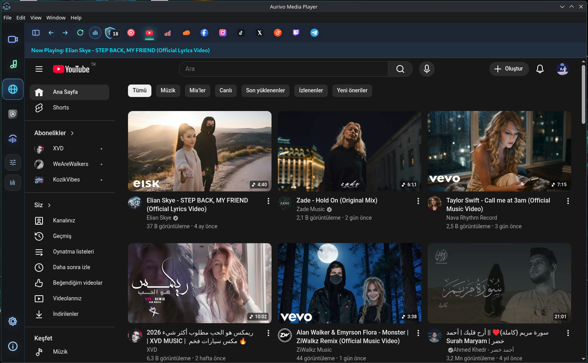
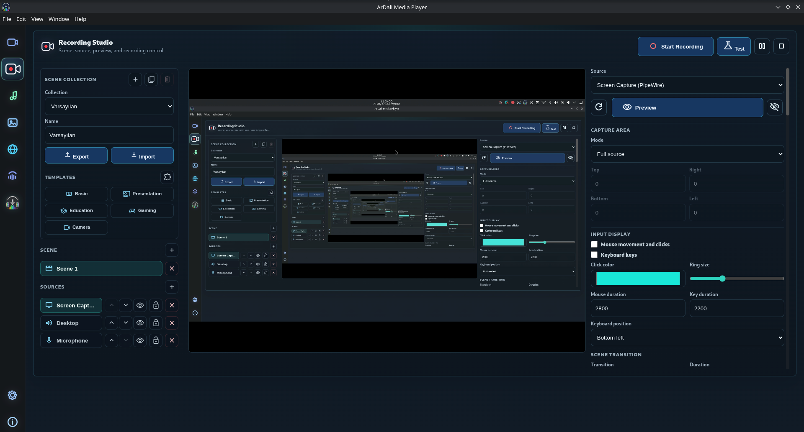
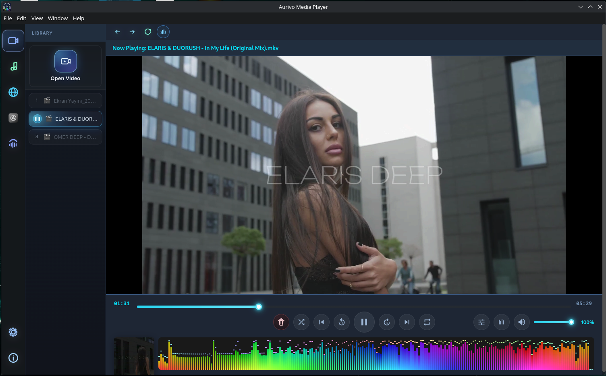
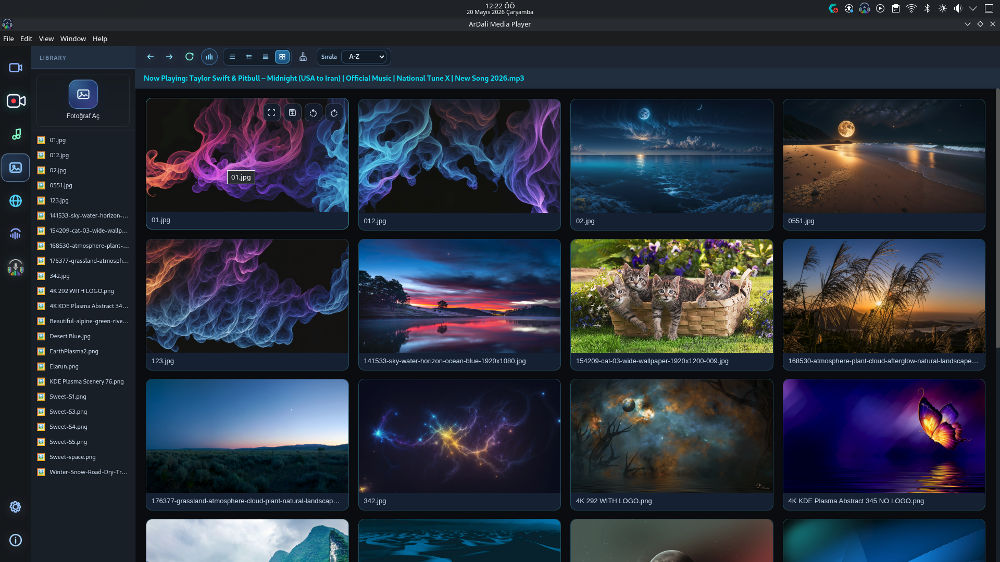
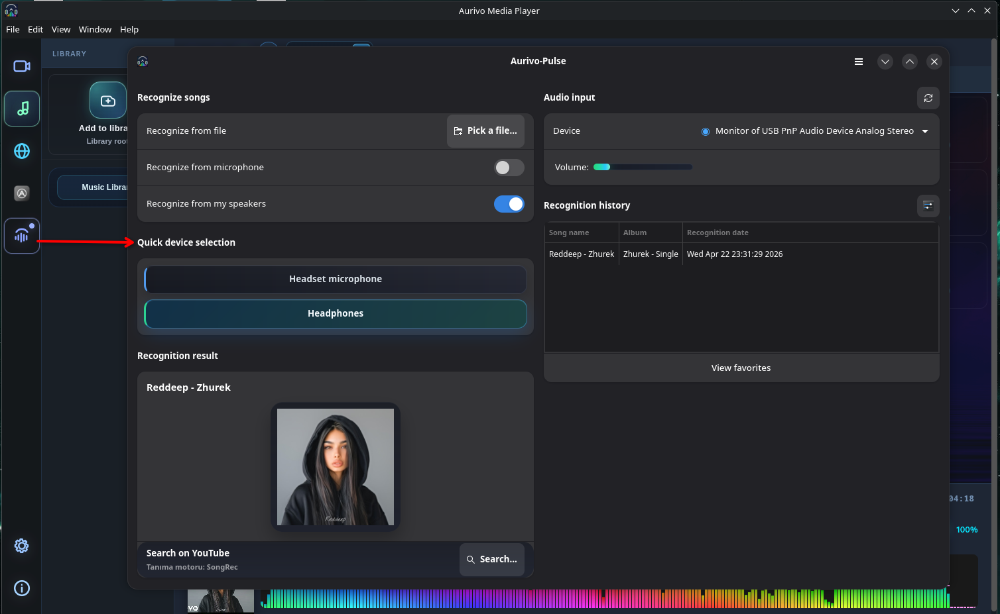
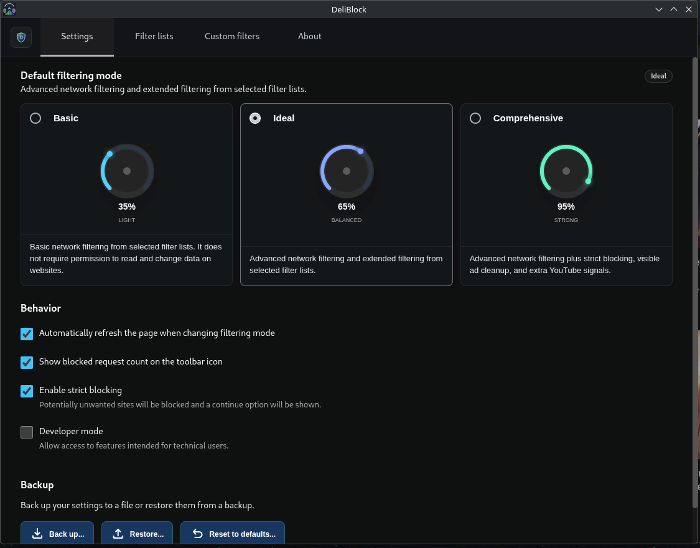
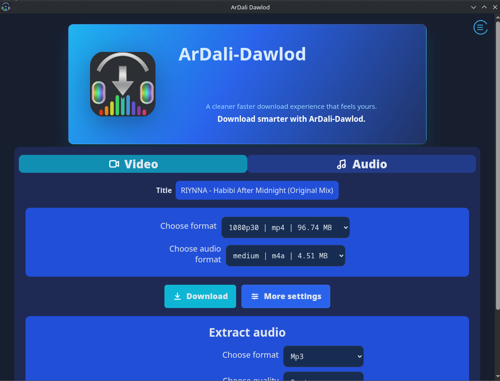

<p align="center">
  
</p>

<p align="center">
  <a href="#english">English</a> | <a href="#turkce">Türkçe</a>
</p>

<p align="center">
  <a href="https://github.com/muhammed-aurivo-dev/Aurivo-Medya-Player-Linux">
    
  </a>
  <a href="https://github.com/muhammed-aurivo-dev/Aurivo-Medya-Player-Linux">
    
  </a>
  <a href="https://github.com/muhammed-aurivo-dev/Aurivo-Medya-Player-Linux/actions">
    
  </a>
  <a href="https://github.com/muhammed-aurivo-dev/Aurivo-Medya-Player-Linux/blob/main/LICENSE">
    
  </a>
</p>

<p align="center">
  <a href="https://github.com/muhammed-aurivo-dev/Aurivo-Medya-Player-Linux/releases/latest">
    
  </a>
  <a href="https://github.com/muhammed-aurivo-dev/Aurivo-Medya-Player-Linux/releases/latest">
    
  </a>
  <a href="https://github.com/muhammed-aurivo-dev/Aurivo-Medya-Player-Linux/releases/latest">
    
  </a>
</p>

<p align="center">
  
</p>

## English

### Aurivo Media Player (Linux)

Aurivo Media Player is a modern and lightweight player built for Linux.

## AI Audit Statement

This project was developed with active AI assistance.

> **Although all code was generated with AI support, every line was personally reviewed before release and validated with security and performance testing.**

In line with Linux community standards, all technical and legal responsibility for this project belongs to the developer, Muhammed.

## Binary Provenance & Integrity

This repository includes a limited set of native shared libraries (`.so` / `.so.*`) used by runtime and packaging.

- Provenance list: `THIRD_PARTY_BINARIES.md`
- Pinned hash manifest: `third_party/binary-manifest.json`
- Integrity check: `npm run verify:binary:manifest`

Release artifact checksum/signature flow is documented in `RELEASE-SIGNING.md`.

## Features

- Built-in web platform mode for media-focused browsing
- Web audio effects for online media playback
- Video player with dedicated video audio effects
- Music player with dedicated music audio effects
- YouTube content downloader
- Song recognition by listening
- Real-time visualization support
- Multi-language UI support (users can choose their preferred language)

## Screenshots

<details>
  <summary>View screenshots</summary>
  <br/>
  <table>
    <tr>
      <td></td>
      <td></td>
    </tr>
    <tr>
      <td></td>
      <td></td>
    </tr>
    <tr>
      <td></td>
      <td></td>
    </tr>
    <tr>
      <td></td>
      <td></td>
    </tr>
  </table>
</details>

## Installation

Primary installation instruction for Arch-based Linux systems:

```bash
yay -S aurivo-bin
```

For other distributions, follow the latest packages and releases on the GitHub release page.

## Packages and Support

- Linux packages: `AppImage`, `.deb`, `.rpm` (see [latest releases](https://github.com/muhammed-aurivo-dev/Aurivo-Medya-Player-Linux/releases/latest))
- Bug reports and feature requests: [Issues](https://github.com/muhammed-aurivo-dev/Aurivo-Medya-Player-Linux/issues)
- Contribution guide: [CONTRIBUTING.md](CONTRIBUTING.md)

## Known Behavior

On some USB/headset audio devices, disconnecting the device may switch the system output route and pause playback. Playback can continue by pressing play again.

## License

This project is released under the MIT License. See [LICENSE](LICENSE) for details.

---

## Turkce

### Aurivo Medya Player (Linux)

Aurivo Medya Player, Linux için geliştirilmiş modern ve hafif bir oynatıcıdır.

## AI Denetim Beyanı

Bu projenin geliştirilme sürecinde yapay zekadan aktif olarak destek alınmıştır.

> **Tüm kodlar AI desteğiyle üretilmiş olsa da, yayınlanmadan önce bizzat tarafımdan satır satır denetlenmiş, güvenlik ve performans testlerinden geçirilmiştir.**

Linux topluluğu standartlarına uygun şekilde, projeye ilişkin teknik ve yasal tüm sorumluluk geliştirici olarak tarafıma (Muhammed) aittir.

## Özellikler

- Medya odaklı kullanım için dahili web platform modu
- Web içerikleri için web ses efektleri
- Video oynatıcıda videoya özel ses efektleri
- Müzik çalarda müziğe özel ses efektleri
- YouTube içerik indirici
- Dinleyerek şarkı bulma
- Gerçek zamanlı görselleştirme desteği
- Çoklu dil desteği (kullanıcı istediği dilde kullanabilir)

## Ekran Görüntüleri

<details>
  <summary>Ekran görüntülerini göster</summary>
  <br/>
  <table>
    <tr>
      <td></td>
      <td></td>
    </tr>
    <tr>
      <td></td>
      <td></td>
    </tr>
    <tr>
      <td></td>
      <td></td>
    </tr>
    <tr>
      <td></td>
      <td></td>
    </tr>
  </table>
</details>

## Kurulum

Arch tabanlı Linux sistemler için birincil kurulum talimatı:

```bash
yay -S aurivo-bin
```

Diğer dağıtımlar için güncel paketler ve sürümler yayın sayfasından takip edilebilir.

## Paketler ve Destek

- Linux paketleri: `AppImage`, `.deb`, `.rpm` ([son sürümler](https://github.com/muhammed-aurivo-dev/Aurivo-Medya-Player-Linux/releases/latest))
- Hata ve özellik talepleri: [Issues](https://github.com/muhammed-aurivo-dev/Aurivo-Medya-Player-Linux/issues)
- Katkı rehberi: [CONTRIBUTING.md](CONTRIBUTING.md)

## Bilinen Davranış

Bazı USB/kulaklık ses cihazlarında bağlantı kesildiğinde sistem ses çıkış rotası değişebilir ve oynatma durabilir. Oynatma, tekrar play ile devam ettirilebilir.

## Lisans

Bu proje MIT Lisansı ile sunulmaktadır. Detaylar için [LICENSE](LICENSE) dosyasına bakabilirsiniz.
