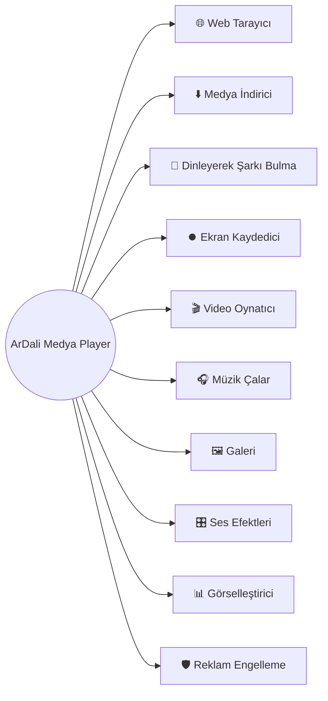

<p align="center">
  
</p>

<p align="center">
  <a href="https://github.com/Muhammed-Dali/ArDali-WebMedia/releases/latest">
    
  </a>
  <a href="https://github.com/Muhammed-Dali/ArDali-WebMedia/releases">
    
  </a>
  <a href="https://github.com/Muhammed-Dali/ArDali-WebMedia/actions/workflows/build-linux.yml">
    
  </a>
  <a href="https://github.com/Muhammed-Dali/ArDali-WebMedia/blob/main/LICENSE">
    
  </a>
</p>

<p align="center">
  <a href="https://github.com/Muhammed-Dali/ArDali-WebMedia/releases/latest">
    
  </a>
  <a href="https://github.com/Muhammed-Dali/ArDali-WebMedia/releases/tag/pacman-repo">
    
  </a>
  <a href="https://aur.archlinux.org/packages/ardali-bin">
    
  </a>
</p>

# ArDali (v3.1.4)

Linux için medya oynatıcı, web ses motoru, müzik/video indirici, ekran kaydedici ve projectM görselleştirici tek bir optimize masaüstü uygulamasında birleşir. ArDali, Linux sistemler için geliştirilmiş; üstün optimizasyon ilkeleriyle tasarlanmış, Electron tabanlı gelişmiş bir multimedya ekosistemidir.

Uygulamanın kalbinde, web tabanlı ses akışlarını sıfır gecikmeyle işleyen ve tamamen bu projeye özel olarak derlenmiş bir teknoloji yatmaktadır.

---

## 🌳 Özellik Dal Haritası (Feature Tree)

Aşağıdaki özellik ağacından dilediğiniz modüle tıklayarak detaylarına ve ekran görüntülerine hızlıca ulaşabilirsiniz.



---

## Modüller ve Arayüzler

### <a id="web-tarayici"></a>🌐 Web Tarayıcı

YouTube, YouTube Music, SoundCloud, Deezer, sosyal platformlar ve genel web gezintisini tek masaüstü uygulamasında birleştirerek harici tarayıcı ihtiyacını ortadan kaldırır.

### <a id="medya-indirici"></a>⬇️ Medya İndirici

Desteklenen popüler sosyal medya ve video platformlarından tek tıkla medya indirir. İndirilen içerikleri tamamen yerel kaynaklar üzerinden farklı ses ve video formatlarına dönüştürebilirsiniz.

### <a id="dinleyerek-sarki-bulma"></a>🎵 Dinleyerek Şarkı Bulma

Ortamda veya sistemde çalan müzikleri gelişmiş akustik parmak izi teknolojisiyle dinleyerek anında tanımlar. Entegre ve hızlı bir Shazam benzeri deneyim sunar.

### <a id="ekran-kaydedici"></a>⏺️ Ekran Kaydedici

Özellikle YouTube içeriği üreten yazılımcılar ve eğitimciler için OBS Studio tarzında çalışan dahili ekran kaydetme altyapısı sunar. Kamera katmanınızı da videonun üzerine anında ekleyebilirsiniz.

### <a id="video-oynatici"></a>🎬 Video Oynatıcı

Geniş codec desteğiyle yerel videolarınızı modern, akıcı ve performanslı bir arayüzde oynatır. Hız, altyazı, uyku zamanlayıcı ve mini oynatıcı destekleri mevcuttur.

### <a id="muzik-calar"></a>🎧 Müzik Çalar

Yerel müzik kütüphanenizi akıllı etiketleme, çalma listeleri, albüm sanatı ve gelişmiş oynatma kontrolleri eşliğinde profesyonelce yönetir.

### <a id="galeri"></a>🖼️ Galeri

Fotoğrafları ve görselleri detaylı inceler. Yakınlaştırma, döndürme, ekrana sığdırma, slayt modları ve hızlı düzenleme araçlarıyla zengin bir ışık kutusu deneyimi sunar.

### <a id="ses-efektleri"></a>🎛️ Ses Efektleri

Donanımsal düzeyde çalışan **32-bant ekolayzır (EQ)** ve sıfır gecikmeli (zero-latency) Dali Ses Motoru ile sesi anında manipüle edin. Web ve yerel müziklerde pürüzsüz uygulanır.

### <a id="gorsellestirici"></a>📊 Görselleştirici

projectM entegrasyonu sayesinde çalan müziğin ritmine, frekansına ve enerjisine göre dinamik olarak şekillenen, donanım hızlandırmalı görsel şölenler üretir.

### <a id="reklam-engelleme"></a>🛡️ Reklam Engelleme

Web tabanlı platformları kullanırken entegre DeliBlock katmanıyla riskli reklamları, izleyicileri ve rahatsız edici pop-up'ları arka planda otomatik olarak filtreler.

---

## Kurulum ve Destek

Projeyi yerel bilgisayarınızda klonlayıp çalıştırmak için:

```bash
git clone https://github.com/Muhammed-Dali/ArDali-WebMedia.git
cd ArDali-WebMedia
npm install
npm start
```

Arch tabanlı Linux sistemler için birincil kurulum talimatı:

```bash
yay -S ardali-bin
```

Pacman repo ile kurulum:

```ini
[ardali]
SigLevel = Optional TrustAll
Server = https://muhammed-dali.github.io/ArDali-WebMedia/x86_64
```

```bash
sudo pacman -Sy
sudo pacman -S ardali-bin
```

Daha fazla bilgi, hata bildirimi ve özellik talepleri için [Issues](https://github.com/Muhammed-Dali/ArDali-WebMedia/issues) sayfasını kullanabilirsiniz.

## Lisans

Bu proje GNU GPL v3 Lisansı ile sunulmaktadır. Detaylar için [LICENSE](LICENSE) dosyasına bakabilirsiniz.
