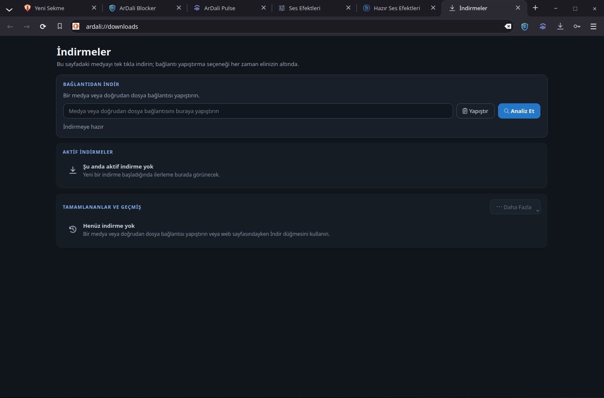

<p align="center">
  
</p>

<h1 align="center">ArDali Browser</h1>

<p align="center">
  <strong>A privacy-focused, high-performance Qt 6 / C++20 desktop web browser featuring an adaptive parallel download engine and an integrated audiophile DSP sound system.</strong>
</p>

<p align="center">
  <a href="https://github.com/Muhammed-Dali/ArDali-Browser/releases/tag/v7.0.1"></a>
  <a href="LICENSE"></a>
  
  
  
  
  
</p>

---

### Quick Download & Installation Options

| Installation Method | Command / Source | Description |
|---|---|---|
| **AUR** | `yay -S ardali` | Precompiled Linux x86_64 package from the Arch User Repository |
| **ArDali Pacman Repo** | `sudo pacman -Syu ardali` | Binary package from the ArDali repository *(configure it first)* |
| **GitHub Releases** | [Releases Page](https://github.com/Muhammed-Dali/ArDali-Browser/releases) | Precompiled standalone `.tar.zst` bundles and source tarballs |

---

<p align="center">
  
</p>

---

## About the Project

**ArDali Browser** is an independent, native Qt 6 / C++20 desktop web browser engineered to unite modern web standards, rigorous personal privacy, high-throughput file downloading, and studio-grade sound reproduction.

Built on top of the Chromium-powered **Qt WebEngine** foundation, ArDali Browser delivers a full-featured internet experience without relying on bloated third-party extensions or intrusive cloud synchronizations. Everything operates locally on your device: an ad and tracking blocker, an adaptive segmented download manager, an encrypted password vault, instant music recognition, and a 32-band peaking equalizer with over 1,750 calibrated AutoEQ headphone correction profiles.

---

## Key Features and Advantages

- **Native Qt 6 & C++20 Architecture:** Zero Electron or web-wrapper overhead. Fast startup, minimal idle RAM consumption, and a responsive Fusion dark theme designed specifically for Linux desktop environments.
- **Hardware-Accelerated WebEngine:** Zero-copy GPU video decoding pipelines, early driver initialization, a child subprocess memory allocator, and active memory pressure monitoring.
- **GeneralDownloadManager (Adaptive Parallel Engine):** Multi-stream downloader that automatically scales connections from **1 → 2 → 4 → 8** parallel streams, featuring dynamic work-stealing, chunk pre-allocation, part-level retries, and HTTP 429 throttling backoff.
- **Smart Omnibox Navigation:** Composite candidate ranking engine combining browser history, bookmarks, and frequent sites with domain normalization and real-time search suggestions (DuckDuckGo, Google, Brave, Bing).
- **ArDali Blocker & Privacy Shield:** Three protection modes (Basic, Balanced, and Aggressive) supporting network request interception, CSS cosmetic filtering, scriptlet injection, and tracking parameter stripping.
- **Zero-Cloud Encrypted Password Vault:** AES-256-GCM encryption with PBKDF2-HMAC-SHA256 key derivation. Completely local, zero-leak credential storage with intelligent in-page autofill and save prompts.
- **Granular Origin Permissions (Site Controls):** Instant toolbar bubble to monitor and toggle permissions per site for Camera, Microphone, Geolocation, Notifications, Popups, and JavaScript optimization, backed by automatic hygiene policies.
- **DALI Web Audio & 1,757 AutoEQ Presets:** 32-band peaking equalizer, BASS FX Reverb, Dynamic Compressor, Brickwall Limiter, Stereo Widener, and factory-calibrated frequency curves for thousands of audiophile headphones.
- **ArDali Pulse (Song Recognition):** Built-in audio analyzer that identifies playing music directly from system audio or microphone input without third-party services.
- **Seamless Linux Desktop Integration:** Strict XDG desktop standards, complete hicolor icon sets (16px through 1024px), and Wayland/X11 compatibility.

---

## Screenshots & Feature Walkthrough

### 1. Modern Desktop Interface & Smart New Tab Experience


> **Main Browser Window & New Tab Page (`ardali://newtab`)**
>
> ArDali Browser features a distraction-free dark interface. The customizable New Tab page provides an integrated digital clock, a search bar with fast engine switching, one-click speed dials, active download widgets, and real-time tracking parameter protection metrics. The top tab strip features active memory hover cards, GPU-accelerated throbber animations, and a sleek bookmarks bar.

---

### 2. ArDali Blocker — Integrated Ad and Tracker Protection


> **ArDali Blocker Dashboard (`ardali://blocker`)**
>
> Designed to preserve bandwidth and privacy, ArDali Blocker offers three distinct operational tiers: **Basic (35% - Light)**, **Ideal (65% - Balanced)**, and **Comprehensive (95% - Strict)**. It evaluates EasyList, EasyPrivacy, Peter Lowe, and regional filter lists locally. Advanced cosmetic filtering eliminates blank ad spaces, scriptlet injection mitigates anti-adblock mechanisms, and strict blocking prevents unwanted popups.

---

### 3. Password Manager — Encrypted Local Credential Vault


> **Secure Local Vault (`ardali://passwords`)**
>
> Your passwords are never transmitted to cloud servers. ArDali's Credential Vault uses **PBKDF2** key derivation and **AES-256-GCM** encryption to safeguard credentials in isolated disk storage. When login fields are detected, the browser securely offers autofill options, while newly entered credentials can be added to the master-password-protected vault with a single click.

---

### 4. ArDali Pulse — Real-Time Music & Audio Recognition


> **Song Finder & Spectrum Analyzer (`ardali://song-finder`)**
>
> Whether music is playing in a browser tab or any other desktop application, ArDali Pulse captures and identifies the track within seconds using system audio or microphone input. Recognition history, artist names, and album details are archived locally for quick reference.

---

### 5. Advanced Download Manager & Adaptive Parallel Engine



> **Downloads Center (`ardali://downloads`) & Toolbar Download Popup**
>
> Powered by the **GeneralDownloadManager** engine, the browser analyzes incoming links and leverages HTTP `Range` headers to split files into concurrent chunks. The engine dynamically ramps connection counts from **1 → 2 → 4 → 8** streams depending on latency and server capabilities, resumes interrupted downloads from the exact byte, and performs automatic chunk-level retries.

---

### 6. 32-Band Studio Equalizer & 1,757 AutoEQ Presets


> **DALI Web Audio Processing Suite (`ardali://audio-effects` & `ardali://eq-presets`)**
>
> Geared toward audiophiles, this system routes web media through 32 precision peaking filters. The suite features **BASS FX Reverb, Dynamic Compressor, Brickwall Limiter, True Peak Limiter, Parametric EQ, Dynamic EQ, Harmonic Exciter, De-esser, Intelligent Noise Gate, Stereo Widener v2, and Echo**. Furthermore, **1,757 calibrated AutoEQ headphone profiles** (covering Sony, Sennheiser, AKG, Beyerdynamic, Apple, Bose, and Audio-Technica) are bundled out of the box.

---

## Installation Methods

### 1. Arch Linux / Manjaro (AUR)

ArDali Browser is officially packaged in the Arch User Repository:

Install the precompiled x86_64 package:

```bash
yay -S ardali
```

---

### 2. Official ArDali Pacman Repository

To receive regular updates directly through `pacman`, append the following lines to `/etc/pacman.conf`:

```ini
[ardali]
SigLevel = Optional TrustAll
Server = https://github.com/Muhammed-Dali/ArDali-Browser/releases/download/pacman-repo
```

Then update your package databases and install:

```bash
sudo pacman -Syu ardali
```

---

### 3. Standalone GitHub Releases Archive

For a direct, package-manager-free installation:

1. Download the latest `ardali-browser-7.0.1-linux-x86_64.tar.zst` from the [GitHub Releases](https://github.com/Muhammed-Dali/ArDali-Browser/releases) page.
2. Extract the archive and merge the directory tree into `/usr`:

```bash
tar -I zstd -xvf ardali-browser-7.0.1-linux-x86_64.tar.zst
sudo cp -r usr/* /usr/
```

---

## Building from Source

### 1. System Prerequisites

Building ArDali Browser requires a C++20-compliant compiler, CMake, Ninja, and Qt 6 development libraries:

**Arch Linux / Manjaro:**
```bash
sudo pacman -S --needed base-devel cmake ninja git nodejs \
  qt6-base qt6-webengine qt6-svg qt6-imageformats \
  openssl libpsl pkgconf ffmpeg
```

**Ubuntu 24.04+ / Debian 13+:**
```bash
sudo apt update
sudo apt install build-essential cmake ninja-build git nodejs \
  qt6-base-dev qt6-webengine-dev libqt6svg6-dev libqt6webenginewidgets6 \
  libssl-dev libpsl-dev pkg-config ffmpeg
```

**Fedora 39+:**
```bash
sudo dnf install gcc-c++ cmake ninja-build git nodejs \
  qt6-qtbase-devel qt6-qtwebengine-devel qt6-qtsvg-devel \
  openssl-devel libpsl-devel pkgconf-pkg-config ffmpeg-free
```

---

### 2. Compilation Steps

```bash
# Clone the repository
git clone https://github.com/Muhammed-Dali/ArDali-Browser.git
cd ArDali-Browser

# Configure with CMake (Release mode)
cmake -S . -B build -G Ninja -DCMAKE_BUILD_TYPE=Release

# Compile across all available CPU cores
cmake --build build -j$(nproc)
```

### 3. Running & Verifying

Run the browser directly from the build directory:

```bash
./build/ardali-browser
```

Execute the full automated test suite (27 standalone test targets):

```bash
ctest --test-dir build --output-on-failure
```

Install directly to the system prefix:

```bash
sudo cmake --install build
```

---

## Developer Section & Project Architecture

ArDali Browser employs a clean, decoupled C++ module structure:

- **`browser/native/core/`**: Profile lifecycle, smart address input resolver, async search suggestions, and GPU hardware acceleration.
- **`browser/native/desktop_tabs/`**: Tab layout engine, tab drag-and-drop controller, tab hover memory cards, and memory pressure monitoring.
- **`browser/native/downloads/`**: `GeneralDownloadManager` adaptive multi-connection engine, transfer UI models, and platform registries.
- **`browser/native/blocker/`**: `ArDaliBlockerEngine`, cosmetic CSS injection runtime, ruleset list manager, and toolbar shield button.
- **`browser/native/passwords/`**: Encrypted `CredentialVault`, autofill coordinator, unlock dialogs, and credential save bubbles.
- **`browser/native/audio/` & `browser/native/eq/`**: Web Audio DSP pipeline, 32-band peaking equalizer, and 1,757 AutoEQ JSON profiles.
- **`browser/resources/`**: AdBlock filter catalogs, AutoEQ frequency JSON files, and Linux `.desktop.in` templates.
- **`packaging/`**: Arch Linux PKGBUILD recipes, AUR manifests, and pacman repository publication definitions.

---

## License & Third-Party Notices

- **ArDali Browser**: Licensed under the [GNU General Public License v3.0](LICENSE).
- **AdBlock Filters & Rulesets**: EasyList, EasyPrivacy, Peter Lowe, and community filter lists retain their respective copyrights and licenses. See [NOTICE.txt](browser/resources/adblock/NOTICE.txt) for full details.
- **AutoEQ Profiles**: Derived from calibrated headphone frequency response curves curated by Jaakko Pasanen and the AutoEQ project.
