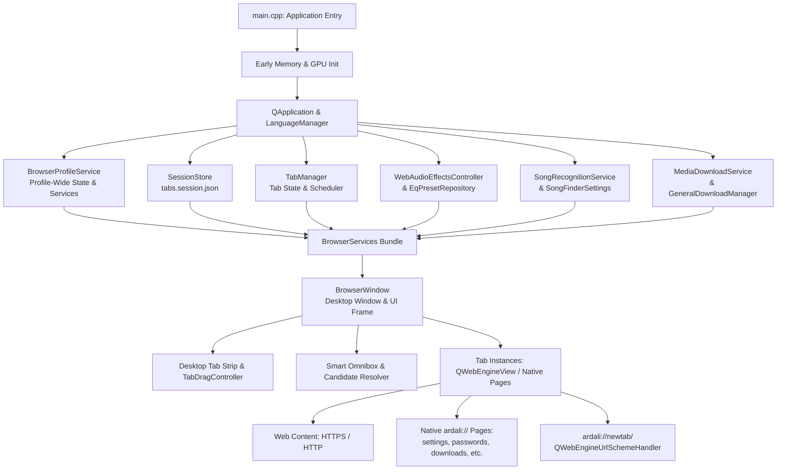

# ArDali Browser Architecture Guide

This document describes the software architecture, component relationships, lifecycle ownership, and security models of ArDali Browser.

---

## 1. System Overview

ArDali Browser is an independent desktop web browser built with **C++20** and **Qt 6**, using **Qt WebEngine** (Chromium) for web standards execution and rendering. It pairs Chromium's rendering capabilities with high-performance native C++ subsystems: an adaptive parallel download engine, a studio-grade 32-band Web Audio DSP equalizer, an encrypted zero-cloud credential vault, an ad/tracker privacy shield, and real-time audio recognition.

---

## 2. Startup Sequence (`browser/native/main.cpp`)

Application initialization follows a strict order to ensure process memory limits, GPU capabilities, and security schemes are established before Chromium processes spawn:

1. **Display & Coordinate Parity:** Detects Wayland sessions and configures `QT_QPA_PLATFORM=xcb` when required to guarantee coordinate parity during tab dragging and multi-window detaching.
2. **Subprocess Allocator Policy (`ardali::WebEngineMemoryPolicy`):** Sets `MALLOC_ARENA_MAX=2` and `MALLOC_TRIM_THRESHOLD=128KB` before subprocess execution to prevent glibc heap fragmentation in renderers.
3. **Hardware Acceleration Flags (`ardali::WebEngineHardwareAcceleration`):** Configures Chromium GPU flags (VA-API zero-copy video decoding, rasterization threads) prior to initializing `QApplication`.
4. **URL Scheme Registration (`registerArdaliUrlSchemes()`):** Registers `ardali://` as a custom scheme with `SecureScheme | LocalScheme | LocalAccessAllowedScheme` prior to GUI construction.
5. **GUI Application Construction:** Instantiates `QApplication`, applies application identity metadata, sets application version, and initializes `LanguageManager`.
6. **Theme & Palette:** Sets Qt `Fusion` style with an audiophile-dark palette (`#202124` background, `#18191c` base).
7. **Policy Loading:** Loads `browser_policy.json` (defining navigation restrictions, popup rules, and download policies).
8. **Core Services Instantiation:**
   - `BrowserProfileService`: Manages `QWebEngineProfile`, bookmarks, history, site permissions, and the ad blocker.
   - `TabManager`: Tracks active/dormant tabs, discard/restore policies, and memory pressure.
   - `SessionStore`: Loads and saves tab state to `tabs.session.json`.
   - `WebAudioEffectsController` & `EqPresetRepository`: Prepares Web Audio DSP graphs and 1,757 AutoEQ curves.
   - `SongRecognitionService`: Initializes Pulse audio capture and Shazam fingerprinting.
   - `MediaDownloadService`: Prepares download engines and local media management.
9. **Window Construction & Session Restore:** Creates the primary `BrowserWindow(services)`, restores geometry from `QSettings`, restores saved tabs if enabled, and connects `QCoreApplication::aboutToQuit` for atomic session saving.

---

## 3. Major Subsystems & Directory Layout

### Core Foundation (`browser/native/core/`)
- `application_identity.h/.cpp`: Application branding, user-agent formatting, and desktop window class naming (`StartupWMClass=ArDaliBrowser`).
- `browser_profile_service.h/.cpp`: Profile-level owner of browsing data (history SQLite, bookmarks JSON, site permissions JSON, search engine providers).
- `web_engine_hardware_acceleration.h/.cpp`: Early GPU command-line configuration, hardware video decoding pipelines, and driver workarounds.
- `web_engine_memory_policy.h/.cpp`: Subprocess memory trim policies and allocation tuning.
- `address_input_resolver.h/.cpp`: Omnibox parser classifying user input as URL, search query, or internal scheme.

### Desktop Tabs & Windowing (`browser/native/desktop_tabs/` & `browser_window.cpp`)
- `browser_window.h/.cpp`: Primary desktop frame owning the toolbar, tab strip, omnibox, bookmark bar, status overlays, and tab views.
- `browser_window_menus.cpp`: Native menus (main menu, history menu, downloads menu, tab and bookmark context menus).
- `browser_window_page_actions.cpp`: Page-level action coordination (find bar, print/PDF, screenshot capture, Reader Mode).
- `tab_drag_controller.h/.cpp`: Chromium-parity tab drag-and-drop controller supporting tab reordering, detaching into new windows, and cross-window tab transfers.
- `tab_hover_card.h/.cpp`: Memory-aware tab preview cards displaying page title, domain, memory consumption, and audio state.
- `tab_manager.h/.cpp`: Tab lifecycle coordinator implementing memory pressure monitoring and background tab discard/reload.

### Browser Settings (`browser/native/settings/`)
- `settings_page.h/.cpp`: Primary settings shell, categories navigation, and base configuration sections.
- `settings_ui_helpers.h`: Shared UI construction components, design cards, and section builders.
- `settings_content_section.cpp`: Content, font, and zoom configuration section.
- `settings_languages_section.cpp`: Multi-language selection, preferred order, and spell check dialogs.
- `settings_performance_section.cpp`: Memory saver, battery saver, and background tab throttling controls.
- `settings_privacy_section.cpp`: Enhanced tracking protection, ad blocker levels, and site permission subpages.

### Password Manager & Vault (`browser/native/passwords/`)
- `credential_vault.h/.cpp`: AES-256-GCM encrypted vault record management (Schema v3) with PBKDF2-HMAC-SHA256 (600,000 iterations).
- `credential_vault_manager.h/.cpp`: Multi-vault disk coordinator managing atomic writes via `QSaveFile`, backup rotations (`.bak`), tamper detection, and auto-lock timers.
- `device_keyring.h/.cpp`: Linux FreeDesktop Secret Service (`org.freedesktop.secrets` / `libsecret-1`) integration binding vault wrap keys to local machine session credentials.
- `credential_autofill_controller.h/.cpp`: Native autofill coordinator communicating with pages via `ApplicationWorld` scripts, issuing single-use fill tokens, and managing credential save flows.
- `credential_save_bubble.h/.cpp`: Non-modal prompt widget offering "Kaydet" / "Şimdi Değil" after login submissions, bound to the verified original origin.
- `password_manager_page.h/.cpp`: Native Qt UI (`ardali://passwords`) for searching, editing, copying, revealing, importing, and deleting credentials.

### Audio DSP & AutoEQ (`browser/native/audio/` & `browser/native/eq/`)
- `web_audio_effects_controller.h/.cpp`: Injects DALI Web Audio DSP nodes into media-playing pages: 32-band peaking equalizer, compressor, limiter, stereo widener, reverb, and noise gate.
- `eq_preset_repository.h/.cpp`: High-performance JSON parser loading and caching 1,757 factory-calibrated AutoEQ headphone profiles.
- `eq_preset_page.h/.cpp`: Native UI (`ardali://eq-presets`) for searching, auditioning, and applying headphone compensation profiles.

### Music Recognition / Pulse (`browser/native/pulse/`)
- `song_recognition_service.h/.cpp`: Captures live 16 kHz mono audio via PulseAudio/PipeWire monitor sources or ALSA microphones, computes audio fingerprints, and matches tracks via Shazam API.
- `song_finder_page.h/.cpp`: Native interface (`ardali://pulse` or `ardali://listen`) with spectrum visualizer and recognition history.

### Downloads Engine (`browser/native/downloads/`)
- `general_download_manager.h/.cpp`: Segmented parallel HTTP/HTTPS downloader dynamically scaling from 1 to 2, 4, or 8 connections with chunk pre-allocation, work-stealing, and resume capabilities.
- `media_download_service.h/.cpp`: Bounded `QProcess` wrapper executing `yt-dlp` and `ffmpeg` for media stream extraction, transcoding, and tagging.
- `local_media_player_page.h/.cpp`: Native internal media player (`ardali://player`) routing downloaded files through the DALI audio DSP suite.

### Ad Blocker & Privacy Shield (`browser/native/blocker/`)
- `ardali_blocker_engine.h/.cpp`: Request filtering engine evaluating EasyList, EasyPrivacy, and Peter Lowe rulesets.
- Handles cosmetic CSS element hiding, scriptlet injection against anti-adblockers, query parameter stripping, and three protection levels (Basic, Balanced, Aggressive).

### Internationalization (`browser/native/i18n/`)
- `language_manager.h/.cpp`: Central language manager supporting Turkish, English, and Arabic, runtime UI translation switching, locale detection, and RTL layout direction.

---

## 4. Ownership & Lifetime Model

Understanding which component owns what resource prevents memory leaks, dangling pointers, and crashes:

| Resource | Primary Owner | Lifetime Scope | Cleanup Trigger |
| -------- | ------------- | -------------- | --------------- |
| `QApplication` | `main.cpp` | Entire application run | Program exit |
| `BrowserProfileService` | `main.cpp` | Application lifetime | Destroyed after all windows close |
| `QWebEngineProfile` (Normal) | `BrowserProfileService` | Application lifetime | Profile service destruction |
| `QWebEngineProfile` (Private) | `BrowserWindow` (Private) | Window lifetime | Closed when private window closes |
| `BrowserWindow` | Window heap / Qt parent | Window lifetime | `close()` / user closes window |
| `QWebEngineView` (Tab) | `BrowserWindow` (`tabs_`) | Tab lifetime | Tab close / window close |
| `QWebEnginePage` | `QWebEngineView` | View lifetime | Replaced on navigation or view deletion |
| Native Pages (`SettingsPage`, etc.) | `BrowserWindow` (`tabs_`) | Tab lifetime | Tab close / window close |
| `CredentialVaultManager` | `CredentialAutofillController` | Window / Profile lifetime | Controller deletion / auto-lock timer |
| `CredentialSaveBubble` | `CredentialAutofillController` | User decision | Explicit Save/Not-Now, or tab close |
| `SessionStore` | `main.cpp` | Application lifetime | Written on `aboutToQuit` or periodic save |
| Download Jobs | `GeneralDownloadManager` | Persisted to disk | Finished, cancelled, or cleared by user |

### Tab Lifecycle
1. **Creation:** `BrowserWindow::addNewTab(url)` allocates a tab record, creates a `QWebEngineView`, hooks navigation signals, attaches the audio controller, and inserts a tab button.
2. **Active State:** The active tab view is placed into the central layout stack. Background tabs remain in memory or are throttled by Chromium.
3. **Discard / Memory Pressure:** When memory pressure occurs, `TabManager` can discard background WebEngine views to free RAM while retaining their URL, title, and scroll state.
4. **Restoration:** Clicking a discarded tab instantly recreates the view and reloads the saved state.
5. **Destruction:** Closing a tab triggers `BrowserWindow::closeTab()`, which:
   - Informs `CredentialAutofillController::onViewClosed(view)` (immediately wiping any active pending credentials in RAM).
   - Detaches audio effects and song recognition observers.
   - Removes the tab button and calls `deleteLater()` on the view.

---

## 5. Source Map: "Where Do I Change X?"

Use this practical directory and file reference to quickly find the code responsible for a specific feature:

| Task | Primary Files to Edit |
| ---- | --------------------- |
| **Change tab behavior, layout, or dragging** | `browser/native/desktop_tabs/`, `browser/native/browser_window.cpp` (`addNewTab`, `closeTab`, `moveTab`) |
| **Change browser settings or preferences** | `browser/native/settings/` (`settings_page.cpp`, `settings_privacy_section.cpp`, `settings_languages_section.cpp`, `settings_performance_section.cpp`, `settings_content_section.cpp`) |
| **Change bookmarks or history handling** | `browser/native/core/browser_profile_service.cpp`, `browser/native/core/browser_profile_service.h` |
| **Change password manager, vault, or autofill** | `browser/native/passwords/credential_vault_manager.cpp`, `credential_autofill_controller.cpp`, `credential_save_bubble.cpp` |
| **Change device keyring / OS secret integration** | `browser/native/passwords/device_keyring.cpp`, `browser/native/passwords/device_keyring.h` |
| **Change music recognition / Pulse** | `browser/native/pulse/song_recognition_service.cpp`, `browser/native/pulse/song_finder_page.cpp` |
| **Change download engine or media downloads** | `browser/native/downloads/general_download_manager.cpp`, `browser/native/downloads/media_download_service.cpp` |
| **Change Web Audio DSP, equalizer, or AutoEQ** | `browser/native/audio/web_audio_effects_controller.cpp`, `browser/native/eq/eq_preset_repository.cpp`, `browser/dali/` |
| **Change ad and tracker blocking** | `browser/native/blocker/ardali_blocker_engine.cpp`, `browser/resources/adblock/` |
| **Change internal `ardali://` pages** | `browser/native/browser_window.cpp` (`showSettings`, `showPasswords`, etc.), `browser/native/newtab/new_tab_scheme.cpp` |
| **Change session restore behavior** | `browser/native/session/session_store.cpp`, `browser/native/browser_window.cpp` (`saveSessionNow`, `restoreSession`) |
| **Change language, translations, or RTL support** | `browser/native/i18n/language_manager.cpp`, `i18n/` catalogs |
| **Change Omnibox search suggestions or candidate ranking** | `browser/native/core/address_input_resolver.cpp`, `browser/native/browser_window.cpp` |

---

## 6. Internal `ardali://` Page Mechanism

ArDali routes internal URLs through two distinct mechanisms:

### 1. Native Qt Widget Pages (Maximum Security)
Pages containing sensitive settings or media playback controls are implemented as **native C++ `QWidget`s** rather than web pages:
- `ardali://settings` -> `SettingsPage`
- `ardali://passwords` -> `PasswordManagerPage`
- `ardali://downloads` -> `MediaDownloadsPage`
- `ardali://audio-effects` -> `WebAudioEffectsPanel`
- `ardali://eq-presets` -> `EqPresetPage`
- `ardali://pulse` / `ardali://listen` -> `SongFinderPage`
- `ardali://player` -> `LocalMediaPlayerPage`

**Security Benefit:** Web content running in WebEngine renderers has zero access to native widget internals, preventing DOM-based privilege escalation or cross-origin attacks against browser configuration.

### 2. Custom URL Scheme Pages (`ardali://newtab/`)
The New Tab page is served via `NewTabSchemeHandler` (`QWebEngineUrlSchemeHandler`):
- Registered as an isolated scheme (`registerArdaliUrlSchemes()`).
- HTML, CSS, and JS are bundled in `browser/native/newtab/new_tab_html.cpp`.
- Search form submissions bridge into browser navigation via `ardali://navigate?q=...&engine=...`.

---

## 7. Settings Storage Architecture

ArDali Browser segregates user configuration based on sensitivity:

1. **`QSettings` (Standard Desktop INI / Config):**
   - Location: `~/.config/ArDali/` or `~/.config/ArDaliBrowser/`.
   - Stores non-sensitive window/application preferences: window geometry, default browser prompts, language preference, theme, search engine selection.
2. **Profile Application Data Directory (`~/.local/share/ArDali/ArDaliBrowser/`):**
   - Resolved via `QStandardPaths::writableLocation(QStandardPaths::AppDataLocation)`.
   - `browser-preferences.ini`: Profile preferences, browsing history (`history/entries`, `history/frequentSites`), bookmarks (`bookmarks/items`), content settings, and origin permissions (`permissions/*`).
   - `tabs.session.json`: Window and tab state for session restore (v1 schema with active index, title, URL, pin state).
   - `profile/` & `cache/`: Qt WebEngine persistent profile storage (cookies, IndexedDB) and disk HTTP cache.
   - `downloads.json`: Active and completed download job metadata.
3. **Encrypted Vault Storage (`vaults/`):**
   - Multi-vault encrypted records restricted to owner-only permissions (`0600`).
   - Encrypted with AES-256-GCM and PBKDF2 key derivation. Never written in plaintext.

---

## 8. Private Browsing Architecture

Private browsing (Incognito / Off-the-Record) is strictly enforced:
- **Dedicated Off-The-Record Profile:** Created via `QWebEngineProfile(QWebEngineProfile::OffTheRecord)`.
- **Ephemeral Storage:** An isolated temporary directory is provisioned at window startup and recursively wiped upon window close.
- **Zero Disk Persistence:** History is disabled, cookies and cache are held in memory only, and passwords are never automatically saved to the persistent profile vault.
- **Visual Distinction:** Window frames and new tab pages display an incognito badge and notice.

---

## 9. Qt WebEngine Development Pitfalls & Lessons Learned

When developing with Qt WebEngine, adhere to the following hard-earned rules:

1. **Asynchronous Object Destruction:** Never access a `QWebEnginePage` or `QWebEngineView` directly in deferred callbacks or lambdas without wrapping it in a `QPointer<T>` guard. If a tab is closed, the view may be scheduled for deletion while an asynchronous JavaScript result or network event is still in flight.
2. **ApplicationWorld for Injected Scripts:** Injected scripts (autofill, ad blocking, cosmetic filters) must always run in `QWebEngineScript::ApplicationWorld`. Scripts running in `MainWorld` can be inspected, overridden, or hijacked by website JavaScript.
3. **Origin Binding Must Survive Navigation:** Websites redirect frequently during login. A pending credential decision or permission prompt must stay bound to the original verified origin rather than mutating when the page navigates.
4. **Avoid Modal Dialog Loops during Page Loading:** Displaying blocking modal dialogs during active page loading can deadlock Chromium event processing. Prefer non-modal bubble overlays (`CredentialSaveBubble`, `SitePermissionPromptBubble`).
5. **Headless / Offscreen Rendering in Tests:** In automated CI environments running with `QT_QPA_PLATFORM=offscreen`, `widget->isVisible()` returns `false` if parents are not physically shown. Verify object existence (`activeSaveBubble() != nullptr`) rather than screen visibility.
